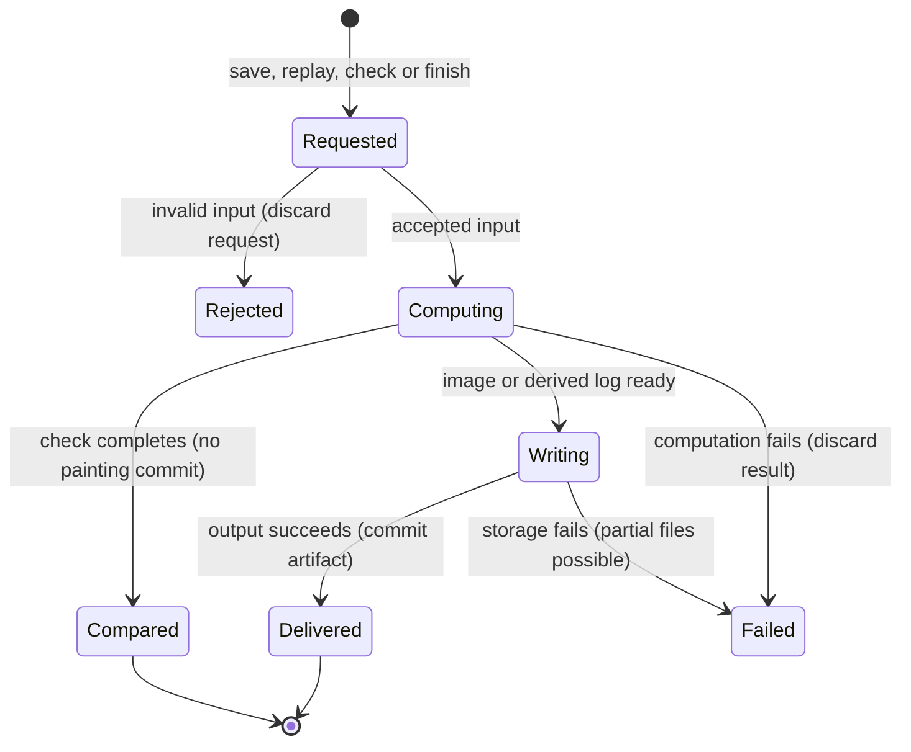

# The replay and delivery workflow

## Summary

The runner can save the current painting, replay its successful log, compare replay with live state, finish a dry painting and produce replay video or an exported painter studio. These operations produce different artifacts: an image is not the editable session, and a finished image is not the unmodified wet painting.

> Technical note: Receipts: `crates/easel/src/main.rs:961` (save/frames/close), `main.rs:994` (PNG), `main.rs:1006` (run), `crates/easel/src/check.rs`, `crates/easel/src/finish.rs:1`, `scripts/check_painting:1`, `scripts/finish_painting:1`, `scripts/replay_clip:1` and `scripts/export_r16_studio:1`.

## The simple case

A painter saves the current image and closes its session. The log remains the replayable painting. The runner compares a replay with the saved live result, then finishes a copy after drying it. The finished PNG is delivered with a companion Lua log that includes the finishing chunk.

## The interaction, event by event

### Starting

Save targets the live selected canvas and an optional output path. Run targets a Lua file and reconstructs it in a disposable replay. Check captures the current successful chunks and live state for comparison. Finish targets a closed-session checkpoint, optionally checking its source log, or the script falls back to replaying a log with a finishing chunk.

### Ending at once

Save without a canvas fails. Run rejects unknown arguments, unreadable input and a program with no parsed chunks. Frame interval and frame directory options must be supplied together. Finish refuses paint that is not fully dry when called directly through finishing verbs. The script rejects an output naming scheme that would overwrite its input log.

### Becoming extended

Replay runs chunks in order using the recorded box and compatibility information. It does not expose a partially successful replay as a live session. Check runs separately from ordinary command handling, allowing the live session to remain available. A new check stops the preceding check job.

Finishing waits in simulated month steps for all films to become touch-dry, with a bounded retry loop. It then applies selected varnish, cracks and relief. This changes the delivered image; ordinary save only captures paint as currently laid.

### While extended

Replay progress appears as chunk progress. Optional replay frames record hand-time milestones, chunk boundaries and the final canvas; drying waits do not become long motionless sections in a hand-time video. Check compares the captured painting, not future chunks submitted after capture. Video creation reuses existing frames only when requested and validates whether duration and maximum hold can fit the available moments.

### Finishing

Save and run write an 8-bit sRGB PNG. Close attempts live PNG, metadata and checkpoint outputs; failure to save the live canvas is reported in its close reply, while the log remains the primary history. A failed PNG write is not promised to remove every partial output.

`check_painting` distinguishes exact agreement from “replay only,” where there is no independent complete live result to compare. Both can exit successfully, so exit status alone does not prove independent reproducibility. A differing comparison reports DIFFERS. The painter's last explicit save can be older than its last chunk and is reported separately.

`finish_painting` writes the finished Lua companion before rendering. A later rendering failure can therefore leave that log without a finished PNG. Successful checkpoint finishing compresses the checkpoint. Replay video produces H.264 MP4 and can also make a contact sheet. Exporting a studio packages a restricted painter binary and notes, not the source project.

## Modifiers

| Variant | Set at the start | Changed while extended |
|---|---|---|
| Save path | Chooses the PNG destination; existing output can be replaced. | Another request does not redirect the pending write. |
| Live frames on/off | Enables or disables a look after each subsequent successful chunk. | The setting command waits behind current ordinary work. |
| Replay width | Default matches live width; development widths change simulation resolution, not just image scaling. | Fixed for the replay. |
| Replay frames | Interval, directory and image width select hand-time capture. | Fixed for the replay. |
| State digest or surface dump | Produces diagnostic replay output in the developer build. | Fixed for the run. |
| Check | Compares a captured live state with replay. | A new check cancels the previous check; later painting is outside the captured comparison. |
| Finishing options | Coats, no-varnish, no-cracks and relief select the derived result. | Fixed for this finish. |
| Checkpoint versus log | Valid checkpoint can avoid full replay; the script falls back if finishing it fails. | Fallback is a new reconstruction, not continuation of a live painter session. |
| Video pace and reuse | Hand-time or dynamic visual-change pacing, duration, hold limits and frame reuse control the clip. | Options do not change during encoding. |
| Studio profile and source ref | Select notes, box and committed source used for the exported painter build. | Profile and source are fixed for this export. |

## Cancel and interrupt

| Event | Before extended | While extended |
|---|---|---|
| Explicit abort | An unstarted export or replay produces no completed artifact. | Stopping a local replay/encoder can leave partial output; stopping a save client does not prove the server write stopped. |
| Another action | Separate output paths allow independent jobs; a live save queues. | A new check stops the prior check. Overlapping writes to the same destination are not a merge workflow. |
| Environment failure | Missing files, executables or permissions can reject startup. | Compute or storage failure can leave partial artifacts; the original log is distinct from derived outputs. |
| Target changed externally | Checkpoint/log validation can reject a mismatch; studio export reads a selected committed ref. | Concurrent destination changes are not reconciled; check uses its captured state. |
| Input channel changed | CLI commands and runner scripts have different artifact/fallback behavior. | Switching invocation form does not change an already running job. |

## Interactions with other systems

**Access.** Finishing and replay are absent from the restricted painter build. Runner scripts operate with local file permissions.

**History.** Save creates no painting chunk. The finishing companion log adds a finishing chunk to a copy of history. A replay does not retroactively alter the source log.

**Containers.** Outputs belong to their selected path or work directory. Export refuses a nonempty destination; `check_painting` requires a new or empty work directory.

**Restricted state.** Finishing requires dry films. Checkpoint validation prevents silently finishing a checkpoint from a different supplied log.

**Offline.** Local replay needs no provider. Build dependencies, encoders and optional image libraries must already be available or obtainable.

**Collaboration.** Export uses build locks. This does not provide collaborative editing of delivered files.

**Notifications.** Commands report paths, progress, comparison outcomes and errors; replay-only is explicitly weaker evidence than independent agreement.

**Preferences.** Options belong to the invocation. Frame capture is session state and resets when a server is recreated.

## Edge cases

- Run accepts widths from 16 to 9600 pixels, although ordinary live width is fixed by the canvas model.
- `frames` with no argument turns capture on; an argument other than `on` turns it off, including misspellings.
- Reopening reconstructs the log rather than restoring from the finishing checkpoint.
- A cropped look is not a full-resolution saved painting.
- The studio export script defaults its source reference to `round-16`, not the current checkout commit. Current-code export needs an explicitly selected source ref.
- A requested video can be too long for its maximum hold and moment count; the script reports the bound rather than stretching it silently.
- Static browser export is owned by [Studio viewer](../watching/studio.md), distinct from exporting a runnable painter studio.
- `peek` is a runner inspection helper, and box/name checks and candidate/test scripts are maintenance surfaces, not additional painting tools.

## Open questions and verification

- Confirmed: a failed chunk can cause a later checkpoint comparison to report DIFFERS despite matching canvas pixels and successful source. The [controlled pass](../verification/evidence/runtime-delivery.md#isolated-failed-chunk-checkpoint-discrepancy) isolated retained chunk/call counters; see [B14](../bug-triage.md#b14--failed-chunks-cause-checkpoint-comparison-failures).

A complete four-second video, checkpoint/replay finishing and pinned blank-profile export passed in the [runtime pass](../verification/evidence/runtime-delivery.md). Other source refs, profiles, video/finish options and long finishing waits remain incomplete. Diagnostic image scripts and maintenance scripts are inventoried as supporting workflows rather than independent painting features. Unexpected `frames` arguments silently disabling capture is recorded in [triage](../bug-triage.md).

Source-reviewed against `../claude-paint` commit `4e525e50897807e9b5f734071dfeb330f1a393d3`; see [verification](../verification/README.md).
