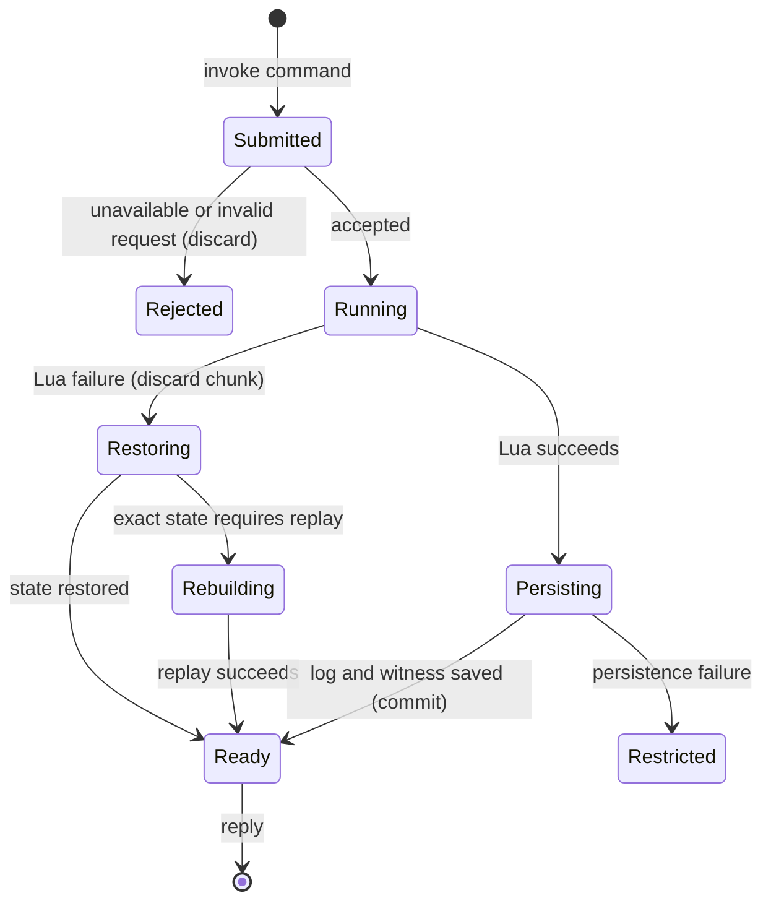

# The command and chunk model

## Summary

The painter submits complete Lua chunks to a background easel. A chunk can make many marks but succeeds or fails as a unit. There is no undo. The terminal uses `do`; the harness presents `paint`. Inspection commands return information without adding painting chunks.

> Technical note: Receipts: `crates/easel/src/main.rs:337` (request and client), `main.rs:924` (dispatch), `crates/easel/src/session.rs:1` (transaction state) and `notes/easel_guide.md:470` (Lua surface).

## The simple case

A painter sends a chunk, waits for its printed output and success reply, then asks for a look. Globals remain available for the next chunk. Locals end with their chunk. The successful source is appended to the log; later correction means another chunk that paints over or lifts paint.

## The interaction, event by event

### Starting

The client selects a session and supplies source inline, from a file or from stdin. Reading the file or stdin completes before the request is sent. Session integrity is checked before ordinary command handling. A live chunk snapshots its preexisting state before execution.

### Ending at once

A missing source, unreadable input file or unavailable session returns an error. Invalid Lua fails without adding a successful chunk. Empty or whitespace-only Lua is rejected. Nonempty Lua that does not paint can succeed and become a chunk; success is not conditional on leaving a visible mark. The [runtime probe](../verification/evidence/runtime-cli.json) records both paths.

### Becoming extended

The server starts Lua and the client waits. Canvas state, globals, held brushes, rags and clock are covered by restoration. The live limit is 600 seconds, checked at Lua instruction hooks; this is not a promise that every long native operation stops exactly at ten minutes. Replays omit the live chunk limit.

### While extended

The chunk can call many painting operations and collect printed text. That text is returned at completion rather than streamed stroke by stroke. Other ordinary requests wait. The painter cannot change submitted source by editing the original file while it runs. Lua has table, string, math and UTF-8 facilities but no `io`, `os`, `require`, `dofile`, `loadfile`, `debug` or `collectgarbage` access.

### Finishing

Successful execution is followed by persistence of the log and its integrity witness. The reply gives the chunk number and compute duration. A Lua failure restores the prior painting, variables, tools and clock. If exact table restoration requires rebuilding, the error explains that replay is in progress; status remains available while other commands are refused. A persistence failure after execution is different: the session can contain uncommitted state and refuse further normal commands. It must not be described as an ordinary clean rollback.

> Technical note: `main.rs:837` saves the log before updating its witness. `main.rs:913` rejects uncommitted state. `main.rs:644` rebuilds after failed restoration. `session.rs:32` defines the deadline.

## Modifiers

| Variant | Set at the start | Changed while extended |
|---|---|---|
| Inline source, file or stdin | Supplies the complete chunk through different input forms. | Original input changes do not modify the accepted request. |
| `--look` | Requests an image after a successful chunk. | No effect on running Lua; a new request is needed. |
| Globals versus locals | Globals survive successful chunks; locals do not. | Lua can assign values while running; they become persistent only on success. |
| Explicit random seed | Controls supported randomness; defaults are deterministic per chunk. | Lua can reseed within the submitted program. |
| Live versus replay | Live execution supports rollback and a deadline; replay aborts on error. | The execution mode does not switch during a chunk. |

## Cancel and interrupt

| Event | Before extended | While extended |
|---|---|---|
| Explicit abort | A queued request whose client is gone is skipped. | Client cancellation does not prove server cancellation. A successful running command can still commit. |
| Another action | Requests are queued through the session socket. | Ordinary commands wait; rebuild permits status but rejects other work. |
| Environment failure | A connection or input read failure prevents normal acceptance. | A server crash loses volatile work; log/witness inconsistency can block reopening. |
| Target changed externally | Changed log content is rejected by integrity validation. | Persistence revalidates the log; externally changing it can prevent commit and restrict the session. |
| Input channel changed | File, stdin, inline source and harness ultimately submit a complete request. | Switching channels does not edit or cancel a running request. |

## Interactions with other systems

**Access.** Painting Lua has no general OS access; command-level file input and output run with the process's permissions.

**History.** Each successful chunk adds one log entry and no undo step. Failed chunks do not shift the next successful chunk's deterministic sequence.

**Containers.** The selected session owns its Lua globals, canvas and held objects.

**Restricted state.** Missing canvas errors are operation-specific. Integrity errors can stop every ordinary command, including close.

**Offline.** Local execution works without a model provider or network.

**Collaboration.** Multiple clients share one serialized session; there is no merge or per-client painting branch.

**Notifications.** Printed output precedes the success line. Failure text distinguishes rollback and rebuild; post-commit image failures are warnings.

**Preferences.** Invocation options apply to one request; globals are painting state rather than application preferences.

## Edge cases

- A chunk can succeed without a canvas when it only uses Lua operations that do not require one.
- A painting operation inside a larger chunk is not an independent commit boundary.
- Catching an error in Lua is not assumed to defeat the easel's after-chunk validity checks.
- Killing a client and killing the server are different interruptions.
- A successful reply lost in transit creates uncertainty for the caller; blindly resubmitting can add another chunk.
- Exact process-crash durability is bounded by the log/witness protocol, not by a generic autosave claim.

## Open questions and verification

- The [runtime pass](../verification/evidence/runtime-delivery.md#isolated-failed-chunk-checkpoint-discrepancy) found that failed chunks leave internal checkpoint counters changed. Paint pixels and successful logs rolled back, but runner checkpoint comparison reported a mismatch; see [B14](../bug-triage.md#b14--failed-chunks-cause-checkpoint-comparison-failures).

Storage failure after execution is a recoverability concern recorded in [triage](../bug-triage.md). The actual [ten-minute Lua deadline](../verification/evidence/runtime-deadline.json) was exercised; crash timing and native-operation interruption boundaries remain incomplete. Runtime evidence is separate from source reading.

Source-reviewed against `../claude-paint` commit `4e525e50897807e9b5f734071dfeb330f1a393d3`; see [verification](../verification/README.md).
