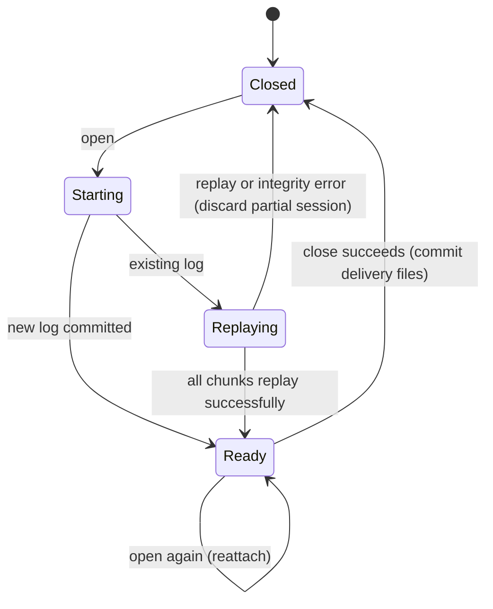

# The session and surface model

## Summary

An easel session is a background process holding one painting. The default developer build supports named sessions, replay and finishing. An exported painter build exposes one painting in its studio. The harness submits work to that easel; the studio browser watches recorded activity without controlling it.

> Technical note: Receipts: `crates/easel/Cargo.toml:7`, `crates/easel/src/main.rs:55`, `main.rs:137`, `main.rs:441` and `crates/easel/src/session.rs:845`.

## The simple case

The runner opens a named session with the default build. Opening creates a server or reattaches to one already running. A previous log is replayed before the session becomes ready. Painting commands then target that session. Closing retains its log and attempts to write the live image and checkpoint used by delivery.

## The interaction, event by event

### Starting

The developer build requires a name containing only ASCII letters, digits, underscores or hyphens. It remembers the last opened session. Explicit `-s` or `--session` overrides `EASEL_SESSION`, which overrides the last-opened selection. The painter build rejects session-selection options and ignores `EASEL_SESSION`.

### Ending at once

Opening a running session reattaches and reports status. Invalid names or open arguments fail. A painter build rejects a name supplied to `open`; its painting is already fixed by the studio.

### Becoming extended

A session lock prevents two servers from serving the same painting. Opening waits for startup or replay. Progress reports name replayed chunks. A replay failure refuses the partial session rather than exposing an incomplete canvas as ready.

### While extended

Opening can take as long as replaying the painting. The startup wait reports failure after 30 minutes with no replay-log progress. This is not a total replay duration cap. An interrupted opening client does not necessarily stop the server it started.

### Finishing

The successful open selects the session and returns status. Close saves the live image, associated metadata and, when possible, a checkpoint, then stops the session and removes its socket. A checkpoint failure can be logged without preventing the other close outputs; delivery owns the fallback. The Lua log remains available for a future reopen.

## Modifiers

| Variant | Set at the start | Changed while extended |
|---|---|---|
| Default developer build | Named sessions, `run`, `check` and finishing are available. | Build capabilities do not change in a running process. |
| Painter build | One `painting` session rooted at the exported studio. | Session switching is unavailable. |
| Existing log | Replays it using its recorded box and engine information. | Editing the log is not supported during replay. |
| `EASEL_ROOT` | Developer build can isolate outputs under another root. | Already running server keeps its root. |
| Box configuration | New painting uses the executable-adjacent box when the environment is absent or agrees; conflicting names reject. With no adjacent file it uses the environment or default. | Existing painting keeps its recorded box; a conflicting configured box rejects reopening. |
| Explicit session option | Directs this command to that named session. | Another command can select another target; the accepted one remains fixed. |

## Cancel and interrupt

| Event | Before extended | While extended |
|---|---|---|
| Explicit abort | A not-yet-started client can exit without opening. | Interrupting open does not guarantee its background server stops. |
| Another action | A concurrent open competes for the same session lock. | It waits or reattaches; ordinary commands require a ready server. |
| Environment failure | Filesystem or launch errors prevent startup. | A stopped server leaves the log; failed integrity validation can prevent reopening. |
| Target changed externally | Log and witness mismatch prevents normal resume. | External changes can make replay or later integrity checks fail. |
| Input channel changed | Terminal and harness address their configured easel. | Switching caller does not transfer a running session to a new root or build. |

## Interactions with other systems

**Access.** Local process and filesystem permissions govern the socket and files; this is not a multiuser login system.

**History.** Reopening reconstructs from the log. The checkpoint is not the ordinary reopening path.

**Containers.** A developer root can contain multiple named sessions; a painter studio exposes one painting.

**Restricted state.** Failed replay and integrity errors do not expose a partly reconstructed painting as healthy.

**Offline.** Opening and painting are local. A model provider is needed only for model-driven requests.

**Collaboration.** Multiple callers can use one session, with serialized commands and one server lock.

**Notifications.** Open reports reattachment or replay progress, status and startup errors. Close reports delivery results.

**Preferences.** Last-opened selection persists in the developer root; the painter build has no selection preference.

## Edge cases

- Opening an existing session does not create a duplicate painting.
- Live width is fixed; `open` rejects width options.
- A stale socket does not itself prove a server is alive.
- A log without engine or box headers follows explicit compatibility rules, not the currently selected new-painting box.
- Old scene helpers are replay compatibility. Their historical art-generation vocabulary is not part of the current tube-based painting workflow.

## Open questions and verification

The [matrix pass](../verification/runtime-pass.md) exercised both builds, all seven current export profiles and all 11 historical golden fixtures. The default historical export failed; a log edit during replay also exposed a waiting-open error path. These are recorded in [triage](../bug-triage.md).

Source-reviewed against `../claude-paint` commit `4e525e50897807e9b5f734071dfeb330f1a393d3`; see [verification](../verification/README.md).
