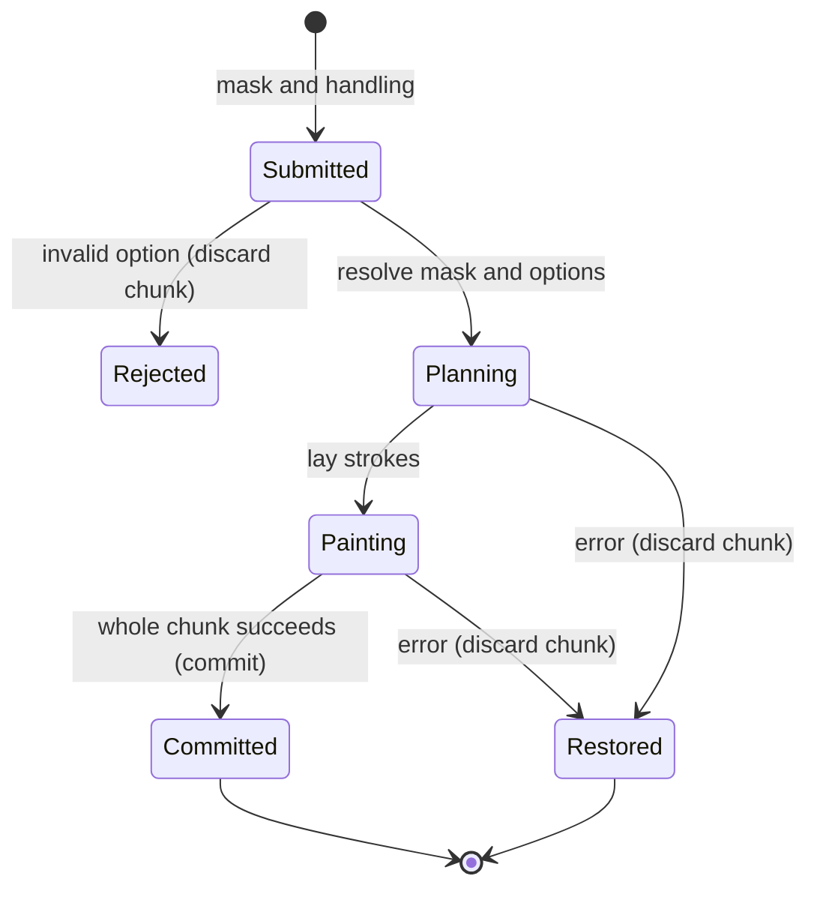

# The painting passage

## Summary

A passage covers a mask with planned strokes or touches. `work` chooses a handling preset, `blend` moves wet paint with a clean blender, `stipple` builds an area from touches and `lose` works across an edge. A mask normally plans where a passage goes; it does not always confine every bristle.

> Technical note: Receipts: `crates/easel/src/api.rs:820` (`work`), `api.rs:1017` (clipping), `api.rs:1060` (stipple), `crates/easel/src/draw_edges.rs` (`lose`), `crates/paint/src/handling.rs` and `notes/easel_guide.md:139`.

## The simple case

The painter creates a mask and pile, then calls `work` with them. The body hand lays a collection of strokes. On success the passage, elapsed hand time and any other operations in the chunk are committed together. A look reveals the result; the command does not stream a developing picture.

## The interaction, event by event

### Starting

A ready canvas, target mask and options define the passage. Paint requires a pile unless the selected operation is clean blending. Options choose the hand, tool, load, pressure, coverage, direction, clipping, stroke order and variation. [Space](space.md) owns visibility and depth restrictions applied before and during painting.

### Ending at once

Unknown options list valid keys in the error. Unknown hand names fail. `edge` and `cut_in` cannot be combined because both specify how to make the edge. A malformed option anywhere in the submitted chunk invokes the normal chunk failure behavior.

### Becoming extended

The easel plans strokes using the handling preset and mask. It resolves numeric or spatial direction/load fields and seeds. For spatial options that accept functions, values are sampled over the region rather than the painter steering each bristle live. The same submitted program determines the whole pass.

### While extended

Strokes draw paint from piles, carry paint over the ground and earlier marks, and spend [hand time](time.md). Wet paint can mix or lift; dry paint supports later marks. Coverage is an average amount of work rather than a promise of a flat opaque fill. Gaps remain unless `fill` requests additional dabs.

The detail and blend hands clip to the mask by default. Body, broad, hatch, glaze and scumble may cross its edge. `clip=true` constrains bristles to the passage mask. A separate clip mask constrains them to that shape. Edge quality instead varies how the painted edge wanders and dissolves; it is not equivalent to hard clipping.

### Finishing

The completed passage remains only if the entire chunk succeeds. A hundred strokes in one chunk create one successful chunk record and no undo steps. `lose` returns a stroke count; a successful passage does not imply every pixel in the mask is now covered.

## Modifiers

| Variant | Set at the start | Changed while extended |
|---|---|---|
| Hand | Body is the default; broad, detail, hatch, glaze, scumble and blend change stroke character. | Submitted options remain fixed. |
| Pile and load | Supply paint and the amount taken per dip; clean blending needs no pile. | A supplied spatial load field varies by location, not by later caller input. |
| Tool and pressure | Choose mark width, shape and contact. | Program-defined variation applies; another request cannot steer it live. |
| Coverage and fill | Set average work; fill adds dabs into gaps when enabled. | No interactive change. |
| Direction and order | Control orientation and sequence, including spatial direction fields and sweep orders. | The planned/programmed field governs later strokes. |
| Clip | True uses the passage mask; a mask uses that limit; defaults depend on hand. | Cannot be changed by a second request mid-pass. |
| Edge or cut-in | Edge varies contour behavior; cut-in uses an additional tool; combining them fails. | No interactive change. |
| Stipple | Touch width, clustering, feathering, drag and twist shape a dotted passage. | Submitted options remain fixed. |
| Lose | Works from outside across the edge and returns stroke count. | Submitted options remain fixed. |
| Seed | Makes supported passage variation repeatable. | No effect from a later request until this chunk ends. |

## Cancel and interrupt

| Event | Before extended | While extended |
|---|---|---|
| Explicit abort | Disconnected queued requests can be skipped. | Client interruption does not guarantee the running pass stops; commands owns the commit rule. |
| Another action | Another command waits. | It cannot insert strokes into the middle of this pass. |
| Environment failure | An unavailable or unready session prevents painting. | Lua failure restores the whole chunk; process or storage failure follows commands' separate rules. |
| Target changed externally | Integrity validation rejects changed logs. | External log edits can prevent persistence; there is no supported concurrent mask editing UI. |
| Input channel changed | The same Lua can arrive through supported command input forms. | It does not retarget the mask or modify pending options. |

## Interactions with other systems

**Access.** Piles must come from the session's tube box; invalid material names fail during mixture creation.

**History.** Passes belong to the enclosing chunk. No per-stroke undo is exposed.

**Containers.** The canvas holds results; masks and piles can be kept in globals for later passages.

**Restricted state.** No canvas, wrong object types and incompatible edge options produce errors.

**Offline.** Passage planning and rendering are local.

**Collaboration.** Another client waits behind the running chunk rather than painting simultaneously.

**Notifications.** Output arrives when the chunk returns. A later look shows the actual coverage and edge behavior.

**Preferences.** Hand presets are starting values; options override the current passage, not all future work.

## Edge cases

- A glaze can visibly extend well outside its planning mask if not clipped. This is described behavior, not automatically a defect.
- A zero or small mask does not justify assuming every possible option is ignored; validation still occurs.
- A clip mask and a depth limit combine rather than giving permission to paint over nearer objects.
- Calling blend on dry paint does not create new paint from an absent pile.
- Spatial functions can fail; their failure belongs to the enclosing chunk.
- Repeating a pass consumes additional hand time and paint operations; it is not replacement of the previous pass.

## Open questions and verification

The [agent matrix](../verification/evidence/matrix-passages.md) records edge, tool, pressure, depth and mask comparisons. Listed scenarios are verified separately; this is not every possible combination. Shared failure behavior is owned by [commands](../foundations/commands.md).

Source-reviewed against `../claude-paint` commit `4e525e50897807e9b5f734071dfeb330f1a393d3`; see [verification](../verification/README.md).
