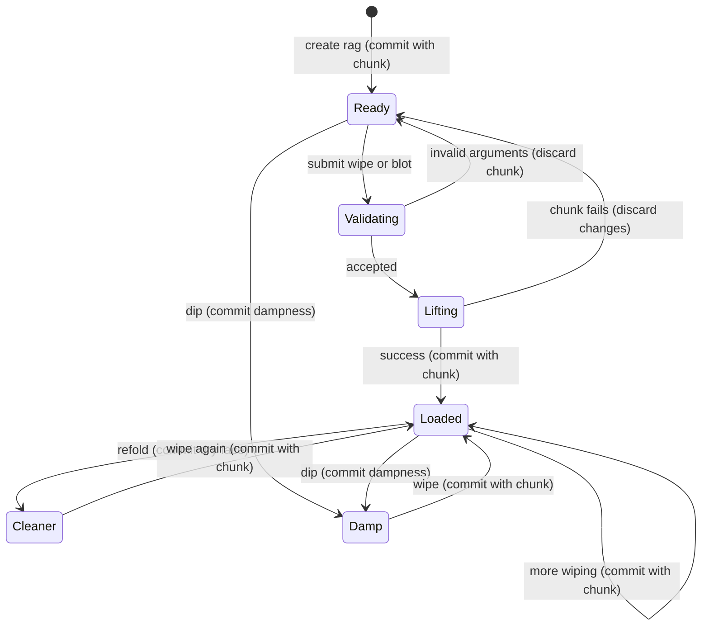

# The rag

## Summary

A rag lifts open paint with a broad, soft cloth pad.
It can wipe along a path, wipe across a mask or blot one point.
Its creases leave streaks and irregular patches rather than a clean digital erasure.
The painter creates it with `rag()` after canvas setup and keeps a global reference to reuse it in later chunks.
The rag remains available on set paint, but cannot lift that paint.

> Technical note: `crates/easel/src/draw_rag.rs:88`, `draw_rag.rs:145`, `draw_rag.rs:196` and `crates/paint/src/rag.rs:1098` establish the surface and limits. Paths here are relative to the source repository.

## The simple case

The painter takes a fresh rag and wipes a path through recently laid paint.
The cloth lifts paint from raised parts first, leaving more in hollows and a thin stain behind.
Some freshly lifted paint smears back along the lightly pressed sides and trailing end.
The rag's face becomes loaded and later wipes lift less.
Refolding exposes a cleaner face; taking another rag starts with clean cloth.
The result is inspected with a [look](looking.md), then the painter continues on the altered canvas.

> Technical note: `crates/paint/src/rag.rs:365`, `rag.rs:466`, `rag.rs:191` and `rag.rs:1127`; the guide describes the visible result at `notes/easel_guide.md:315`.

## The interaction, event by event

### Starting

Creation needs an existing canvas.
The default pad is about 40 mm across; an explicit width uses canvas units.
The rag starts clean and dry, with fold number zero.
A wipe accepts either a mask or a nonempty list of finite path points.
A blot accepts one finite canvas position.
Default pressure is 0.5.
The painter may supply seeds for the rag and its operations to make their cloth variation repeatable.

> Technical note: `crates/easel/src/draw_rag.rs:32`, `draw_rag.rs:88`, `draw_rag.rs:145` and `draw_rag.rs:196`; `crates/paint/src/rag.rs:184` initializes the cloth.

### Ending at once

Unknown options fail.
Mask wipes require one pressure value and a whole-number pass count from 1 through 20.
Path wipes reject angle, pass-count and automatic-refold options.
Empty paths and nonfinite positions fail.
A one-point path or a path shorter than 0.001 canvas units becomes a blot.
Finite pressure values outside 0 through 1 are clamped, not rejected.
A zero-pressure operation may spend hand time without lifting paint.

> Technical note: `crates/easel/src/draw_rag.rs:32`, `draw_rag.rs:89`, `draw_rag.rs:124`; `crates/paint/src/rag.rs:534` chooses blot behavior and `rag.rs:365` handles contact.

### Becoming extended

A path wipe moves the pad along the submitted points.
A pressure list changes pressure gradually along the whole path, rather than assigning one independent pressure to each point.
A mask wipe plans side-by-side strokes that travel back and forth in the chosen direction.
Stroke centers start and stop inside the mask, but the pad's edge can extend past it.
The mask is a planning region, not a clipping boundary.
No supported option turns this rag operation into a clipped eraser.

> Technical note: `crates/paint/src/rag.rs:534`, `rag.rs:665` and `rag.rs:700`; Lua's accepted options are listed at `crates/easel/src/draw_rag.rs:19`.

### While extended

The cloth lifts less as its face fills and as paint sets.
Harder pressure reaches farther into hollows and flattens more folds.
A damp face lifts open paint more readily and reaches deeper, while still leaving cloth variation.
Automatic refolding is checked before each planned mask stroke when load exceeds the requested threshold.
Each refold exposes a dry face; automatic refolding does not automatically dip it again.
Additional passes cross the region again with a small directional change.
Long region wipes age paint as the hand works; [painting time](time.md) owns the clock boundaries.
There is no streamed visual preview during the chunk.

> Technical note: `crates/paint/src/rag.rs:191`, `rag.rs:232`, `rag.rs:365` and `rag.rs:665`; `crates/easel/src/draw_rag.rs:117` uses covering-operation time rules.

### Finishing

A successful chunk retains the changed canvas, rag state and hand time as one painting-log entry.
Several wipes, dips and refolds in that chunk are not separate undo steps.
A failed chunk restores the prior rag, paint and clock under the [command model](../foundations/commands.md).
The rag methods themselves return no image; looking is a separate operation.

The painter can read width, load, soaked amount, dampness and fold number.
These fields cannot be assigned to clean the cloth or change its size.
Refolding sets face load to the cloth's soaked amount, clears dampness and advances the fold number.
Dipping raises dampness to at least the chosen amount after accounting for evaporation; it does not rinse out load or soaked paint.

> Technical note: `crates/easel/src/draw_rag.rs:66`, `draw_rag.rs:145`, `draw_rag.rs:286` and `draw_rag.rs:306`; `crates/paint/src/rag.rs:191` and `rag.rs:203` define refolding and dipping.

## Modifiers

| Variant | Set at the start | Changed while extended |
|---|---|---|
| Width | Chooses pad width; omitted width corresponds to 40 mm. | Read-only. A new rag is needed for another width. |
| Path | Wipes along submitted points, using scalar pressure or a pressure profile. | Points and profile remain fixed. |
| Mask | Plans an area of strokes; its edge does not clip the cloth. | Plan remains fixed; accumulated load changes lifting. |
| Pressure | Defaults to 0.5; finite values clamp to 0 through 1. | A supplied path profile varies pressure as planned. No interactive adjustment. |
| Angle | Sets mask-stroke direction in radians. | Later passes vary slightly around it; path wipes reject this option. |
| Passes | Mask-only integer from 1 through 20, default 1. | Repeated passes use the same cloth and its accumulating load. |
| Refold threshold | Mask-only automatic refolding when load exceeds the clamped threshold. | Checked before each planned stroke; a refold makes the face dry. |
| Dip | Defaults to 0.5; finite amount clamps to 0 through 1. | Dampness evaporates with painting time. Another dip is a separate operation. |
| Seed | Controls rag creases and operation variation. | Submitted seed is fixed; refolding changes the face pattern. |
| Existing paint state | Fresh paint lifts readily, setting paint less and set paint not at all. | Long operations can encounter paint that has aged during work. |

> Technical note: `crates/easel/src/draw_rag.rs:32`, `draw_rag.rs:99`, `draw_rag.rs:163`; `crates/paint/src/rag.rs:203`, `rag.rs:236` and `rag.rs:665` own these variants.

## Cancel and interrupt

| Event | Before extended | While extended |
|---|---|---|
| Explicit abort | A disconnected queued request can be skipped. | Stopping the client does not prove wiping stopped; commands owns this boundary. |
| Another action | Another ordinary command waits. | It cannot change the rag midway through this chunk. Later work sees the committed state. |
| Environment failure | An unavailable session prevents the operation. | Server or persistence failure follows commands; a missing reply is not evidence of rollback. |
| Target changed externally | Integrity checking can reject a changed painting log. | External changes can prevent normal commit; no supported external rag editor exists. |
| Input channel changed | Terminal and harness submit the same Lua operations. | Switching channel does not edit or cancel accepted source. |

The [command model](../foundations/commands.md) owns interruption and commit guarantees.
Ordinary Lua failure restores cloth state along with canvas state.

> Technical note: Rag restoration has a direct source test at `crates/easel/src/draw_rag.rs:286`; client and server boundaries are documented in commands.

## Interactions with other systems

**Access.** Creation requires a canvas. The operation acts on its paint, not arbitrary image files.

**History.** Rag operations share the enclosing chunk's commit. There is no rag-specific undo or clean-field assignment.

**Containers.** A global rag remains reusable across chunks. Aliases refer to the same held cloth; creating another rag produces fresh independent cloth.

**Restricted state.** Set paint and dry ground cannot be lifted. Wiping fresh paint above a set film can expose that film without removing it.

**Offline.** Rag computation is local and needs no provider connection.

**Collaboration.** Callers sharing a session share global rag state. Another caller has no private copy of a named rag.

**Notifications.** Printing a rag shows rounded width and face load. Its read-only fields provide more state; a look shows the canvas result.

**Preferences.** Width and initial seed belong to the rag. Wipe and blot options belong to each operation.

> Technical note: `crates/easel/src/draw_rag.rs:26`, `draw_rag.rs:66`, `draw_rag.rs:196`; `crates/paint/src/rag.rs:1098` tests the set-paint boundary. Session ownership follows [canvas](../foundations/canvas.md).

## Edge cases

- A positive width smaller than 0.1 canvas units is accepted but stored as 0.1. Zero, negative and nonfinite widths fail.
- Dampness halves every three minutes of painting time and becomes zero below 0.01. Real time between chunks is not painting time.
- Refolding repeatedly does not remove the paint soaked through the cloth. There is no fixed refold-count cutoff; a saturated cloth simply offers no clean face.
- A dip of zero does not instantly dry an already-damp face. Dipping does not reduce existing dampness except through elapsed painting time.
- A blot makes a crumpled patch without the wipe's traveling smear-back behavior.
- An empty mask produces no planned wiping strokes. Off-canvas contact cannot lift paint outside the canvas.
- Wiping set paint can still spend hand time while leaving the rag clean.
- Historical logs from before engine 3 do not expose the Lua rag global. They are replay compatibility, not the current rag surface.

> Technical note: `crates/paint/src/rag.rs:184`, `rag.rs:203`, `rag.rs:211`, `rag.rs:633`, `rag.rs:700` and `rag.rs:1098`; historical availability is tested at `crates/easel/src/draw_rag.rs:334`.

## Open questions and verification

The [agent matrix](../verification/evidence/matrix-marks.md) exercises cloth state, streaking, dip/refold, wet/dry contact, mask edges, saturation and rollback. Shared interruption probes act at the containing chunk boundary.
No new suspected defect is established from this source pass.
Exact artistic appearance is not reducible to one percentage of paint removed; the source tests use particular paint, ground and timing setups.

Source-reviewed against the repository commit `4e525e50897807e9b5f734071dfeb330f1a393d3`; runtime verification belongs in [verification](../verification/README.md).
