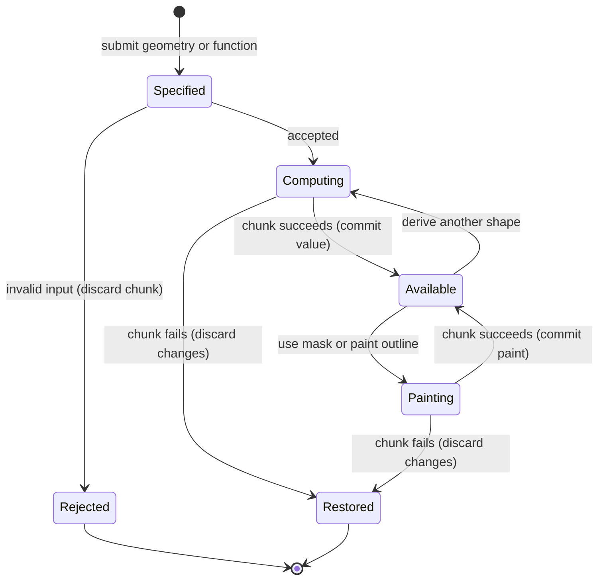

# The shape and mask

## Summary

Shapes prepare regions and paths for later painting.
A mask describes coverage across the canvas; an outline describes a drawn boundary and its planned strokes.
Creating either leaves the visible canvas unchanged.
The painter reaches them through Lua constructors, combines or transforms them and passes the result to painting, clipping or drawing.
There is no shape-selection overlay or interactive point editor.

> Technical note: [api.rs](../../claude-paint/crates/easel/src/api.rs):637–690 and :1358–1403 construct mask values. [draw_outline.rs](../../claude-paint/crates/easel/src/draw_outline.rs):169–179 and :200–232 construct outlines separately from :305–340 painting them.

## The simple case

The painter creates an ellipse or polygon, stores the mask in a global and passes it to a [passage](passages.md).
The mask plans where the passage works; explicit clipping has the separate meaning described there.
To paint a boundary, the painter creates an outline and calls its `paint` method with a [held brush](brushes.md).
The brush follows the outline's planned strokes and retains its paint afterward.
A [look](looking.md) shows the resulting paint, not an independently visible shape object.

## The interaction, event by event

### Starting

Coordinates follow the [canvas model](../foundations/canvas.md).
`everywhere` covers the canvas; rectangles take position, width and height; ellipses take a center and radii.
A polygon takes points, with optional smoothing.
`below` and `above` use a point list or a function of x.
A ribbon follows points with one width or a width per point.
`mask(function)` evaluates coverage at every canvas pixel center.
Outline construction takes points and character options; `body_of` instead takes a spine, widths and optional limbs.

> Technical note: [api.rs](../../claude-paint/crates/easel/src/api.rs):680–705 and :1358–1403 define geometry forms. [draw_outline.rs](../../claude-paint/crates/easel/src/draw_outline.rs):200–232 builds bodies.

### Ending at once

A polygon requires at least three points; a ribbon requires at least two and matching widths.
An outline requires at least two points.
A body permits a one-point spine for a blob, but each limb requires at least two points and explicit widths.
Invalid option names in outline, body, noise and outline painting calls fail.
Requesting an inside mask from an open outline fails with guidance to use above, below or a closed outline.
No paint is committed merely because geometry construction succeeded.

> Technical note: [api.rs](../../claude-paint/crates/easel/src/api.rs):1370–1402 and [draw_outline.rs](../../claude-paint/crates/easel/src/draw_outline.rs):169–225, :244–249 own these checks.

### Becoming extended

Mask computation can evaluate a Lua function across the complete canvas.
Finite callback values below zero or above one are clamped to coverage bounds.
A function error fails the chunk under [commands](../foundations/commands.md).
Outline construction generates the boundary and planned strokes from the supplied character and seed.
These results are fixed values, not live links to later changes in the point table or callback variables.

### While extended

Mask operations return new masks, leaving their inputs available.
Union keeps the larger coverage at each point; intersection multiplies coverage; difference multiplies the first coverage by one minus the second.
Inverse replaces coverage with one minus itself.
Blur smooths coverage; soften rebuilds the edge with a chosen transition width.
Grow, shrink and offset move the boundary; rim selects the inside near it.
Roughen shifts the boundary unevenly using a seeded pattern.
`times` multiplies by another mask or evaluated function; `map` transforms each stored value.

`distance` returns signed distance from the mask edge: positive inside and negative outside.
That result is a field, not ordinary coverage; `band` or `map` can turn it back into coverage.
`band` selects stored values between two levels, so its meaning depends on whether the input contains distance or coverage.

> Technical note: [api.rs](../../claude-paint/crates/easel/src/api.rs):637–678 exposes transformations. [mask.rs](../../claude-paint/crates/paint/src/mask.rs):123–223 defines combination, distance and edge operations.

### Finishing

A successful construction chunk retains global shapes and records one chunk without necessarily changing paint.
`area()` reports coverage-weighted square canvas units; `at(x,y)` samples a mask.
Outlines expose paths, corners, planned strokes, length and a position with tangent and outward normal at a fraction along the outline.
Inset and offset return another outline.
Outline painting executes planned brush strokes and returns their count.
Optional dipping loads the brush before the first stroke and then at the requested interval; it does not wipe between dips.
An error in later painting discards the chunk's earlier changes according to [commands](../foundations/commands.md).

> Technical note: [api.rs](../../claude-paint/crates/easel/src/api.rs):650–659 calculates area. [draw_outline.rs](../../claude-paint/crates/easel/src/draw_outline.rs):264–340 implements inspection, offsets and painting.

## Modifiers

| Variant | Set at the start | Changed while extended |
|---|---|---|
| Primitive or callback mask | Chooses the coverage calculation. | Accepted inputs stay fixed; later operations create new masks. |
| Polygon smoothing | Smooths the submitted polygon. | Requires another construction. |
| Outline open or closed | Defaults to closed for at least three points; explicit closed takes precedence over open. | Requires another construction. |
| Corner marks | Explicit point marks or indices override automatic corners; true marks all and false marks none. | Existing outline retains its corners. |
| Firm character | Long strokes with slight overshoots and a crisp mask; outline default. | Fixed during construction and later painting. |
| Searching character | Short, restated strokes that can run past corners. | Fixed. |
| Broken character | Facets and chipped stretches alternate with quieter stretches. | Fixed. |
| Soft character | Lobes and light broken strokes with uneven soft edges; body default. | Fixed. |
| Amount, size, lobe and edge | Control irregularity, its scale, lobe width and edge softness. | Requires another construction. |
| Seed | Repeats the selected pattern for the same construction inputs. | Does not revise existing objects. |
| Body blend | Controls joining of the spine and limbs; default 0.8. | Requires another body. |
| Outline paint options | Pressure, shake, ramps and clip alter its executed marks. | Running marks retain accepted options. |
| Dip and every | Load a pile during outline painting at the requested stroke interval. | Changes brush state in the submitted sequence. |
| Noise, cellular pattern or uneven spacing | Supply repeatable values for position-dependent variation. | Queries use that object's configured pattern. |

> Technical note: [draw_outline.rs](../../claude-paint/crates/easel/src/draw_outline.rs):61–97, :102–179 and :305–340 own options; character descriptions are in [easel_guide.md](../../claude-paint/notes/easel_guide.md):267–276.

## Cancel and interrupt

| Event | Before extended | While extended |
|---|---|---|
| Explicit abort | A disconnected queued request can be skipped. | Stopping the client does not prove computation stopped; commands owns cancellation. |
| Another action | Another ordinary request waits. | It cannot edit a running construction or outline paint. |
| Environment failure | An unavailable session prevents acceptance. | Process and persistence failures follow commands; no independent geometry autosave exists. |
| Target changed externally | Integrity checks can reject the request. | External log edits can block persistence; they do not update the computed geometry. |
| Input channel changed | Inline source, files and harness use the same constructors. | Accepted source remains fixed. |

After success, global geometry remains reusable.
After ordinary rollback, preexisting geometry and paint remain as before the chunk.

## Interactions with other systems

**Access.** Geometry comes from Lua values and functions, not an imported image file picker.

**History.** Successful construction is logged as part of its chunk. Masks are not undo checkpoints.

**Containers.** Globals retain masks and outlines; derivations produce separate values rather than editable layers.

**Restricted state.** Canvas-sized masks require an initialized canvas. An open outline has no inside mask.

**Offline.** Shape construction and numeric helpers run locally.

**Collaboration.** Session clients share global objects through serialized chunks; there is no concurrent point editing.

**Notifications.** Printed masks report area; printed outlines report line count, closure, length, stroke count, corner count and scale. Painting returns a stroke count; visual inspection requires a look.

**Preferences.** Seeds and character settings belong to constructed objects. They are not a global drawing-style preference.

> Technical note: [api.rs](../../claude-paint/crates/easel/src/api.rs):675–678 and [draw_outline.rs](../../claude-paint/crates/easel/src/draw_outline.rs):342–353 define printed summaries. Shared lifecycle facts belong to [commands](../foundations/commands.md).

## Edge cases

- An inset that consumes a closed shape has an empty mask; it is not rejected as an open line.
- `amount=0` removes character irregularity even when an explicit lobe size was supplied.
- Outline size must be at least 1 unit. A positive lobe must be at least 0.5 units; zero disables it.
- An open line's outward side is its left. Closed paths returned by `path()` do not repeat the first point.
- Mask sampling beyond the canvas clamps to the edge sample rather than returning zero.
- `map` does not clamp returned values. Its output and `distance()` must not automatically be treated as ordinary coverage.
- `rand()` yields a unit-range value, `rand(hi)` scales from zero and `rand(lo,hi)` uses the supplied bounds. `randn` defaults to mean zero and standard deviation one.
- `math.random` supports Lua integer ranges; its deterministic chunk behavior belongs to [commands](../foundations/commands.md).
- `lerp`, `clamp` and `smoothstep` provide interpolation, bounding and smooth transitions; clamp defaults to zero and one.
- Noise supports fbm, ridged, billow and plain, with seed, octave count, period, persistence, warp and stretch. Default noise uses seed 1, four octaves and period 200.
- Noise is callable and has `at` and `at01`; the latter provides the zero-through-one form. It can drive passage coverage or loading.
- Worley queries return nearest and second-nearest cell-point distances, proximity to a cell wall and a stable value per cell. Calling it directly returns only the nearest distance. Its default period is 40 and seed is 1.
- `uneven` returns positions with irregular, clumped gaps. Its default irregularity is 0.6, clumping 0.3 and seed 1.
- Outline painting defaults to pressure multiplier 1, shake 0.3, loading every three strokes and load amount 0.6 when a dip is supplied. An interval of zero is treated as one.

> Technical note: [draw_outline.rs](../../claude-paint/crates/easel/src/draw_outline.rs):379–425 tests consumed insets, minimum sizes and zero irregularity. [mask.rs](../../claude-paint/crates/paint/src/mask.rs):147–160 owns sampling. [api.rs](../../claude-paint/crates/easel/src/api.rs):662–667, :747–765, :1137–1205 and :1293–1356 define mapping and numeric helpers.

## Open questions and verification

- This document is source-reviewed, not manually verified.
- Visual character, body joins, edge transformations and noise variation have [recorded agent comparisons](../verification/evidence/matrix-marks.md).
- Nonfinite callbacks and extreme geometry have separate [recorded cases](../verification/evidence/matrix-marks.md); finite coverage wording alone does not settle their behavior.
- The guide's general 0–1 mask description needs qualification for `distance()` and unrestricted `map()` output. This document preserves the distinction rather than promising bounded values everywhere.

Source-reviewed against `../claude-paint` commit `4e525e50897807e9b5f734071dfeb330f1a393d3`; runtime verification is recorded separately in [verification](../verification/README.md).
