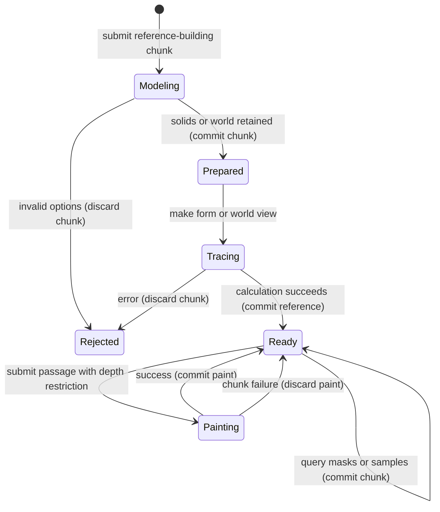

# The space and light references

## Summary

Space and light references answer where a modeled surface lies, how it turns toward light and what hides it.
They do not paint a subject automatically.
The painter builds solids, combines them into a lit form or places them in a perspective world, then uses the resulting masks and directions in painting commands.
A traced world view also supplies depth restrictions that protect foreground shapes during later passages.
These operations are Lua calls in an open session; forms and worlds that use the canvas need its setup first.

> Technical note: Receipts: `crates/easel/src/form.rs:1`, `crates/easel/src/form.rs:439`, `crates/easel/src/world.rs:1`, `crates/easel/src/world.rs:365` and `notes/easel_guide.md:350`. [Canvas](../foundations/canvas.md) owns canvas setup and [commands](../foundations/commands.md) owns execution.

## The simple case

The painter creates a world with a horizon and eye height, chooses a spot on its ground and builds a body at that spot's scale.
Placing the body returns a new world and a body number.
The painter retains the new world, traces a view and asks where that body or the water is visible.
A passage uses the answer as a mask, with a chosen pile and handling.
Only that painting operation changes the painted canvas.
The same view can be reused for another passage without tracing again.

> Technical note: Receipts: `crates/easel/src/world.rs:125`, `crates/easel/src/world.rs:292`, `crates/easel/src/world.rs:329` and `crates/easel/src/depth.rs:171`.

## The interaction, event by event

### Starting

A standalone form uses canvas coordinates, with positive depth pointing toward the painter.
Bodies can be ellipsoids, rounded blocks or half-spaces.
They can turn, receive a cut, gain roughness or combine by union and subtraction.
Each operation returns another body; retaining the original also retains its old shape.
A terrain reference instead samples a height function over a canvas rectangle.
Returning no height leaves a hole in that reference.
Terrain can enter a form but cannot use body-only turning, cutting, weathering or combination operations.

A form takes an ordered list of solids and optional distance information, then one light.
Its light can include ambient illumination, reflected light, shadow softness, reach, thickness and interaction across parts.
The painter can keep multiple forms with different lighting.
These are reference alternatives, not lighting changes to paint already laid down.

A world uses meters: X rightward, Y upward and Z away from the eye.
The camera looks level from its eye height; the horizon is a canvas y coordinate.
The default world covers the whole canvas, places its horizon halfway down and uses eye height 1.6 m with a 45-degree horizontal field of view.
Ground is flat by default and water is absent.
The default sun has azimuth -120 degrees and elevation 35 degrees.
Sun angles use degrees; body rotations use the ordinary angle conventions in [canvas](../foundations/canvas.md).

> Technical note: Receipts: `crates/easel/src/form.rs:95`, `crates/easel/src/form.rs:366`, `crates/easel/src/form.rs:395`, `crates/easel/src/form.rs:408`, `crates/easel/src/world.rs:365` and `crates/paint/src/scene.rs:35`. The nearby `world.rs:361` comment says 50 degrees, but the actual default at `world.rs:375` is 45.

### Ending at once

Unknown option names fail rather than becoming hidden preferences.
A terrain rectangle must have four coordinates, finite bounds and at least one sampling step in each dimension.
A body-only operation rejects terrain.
World placement also rejects terrain; it places bodies.
A canvas point in the sky or outside the world's view does not identify a ground spot.
Converting such a point to a depth returns an error rather than guessing a distant location.
Unknown depth-layer names report the available names and the need to build a view after registration.
A painting restriction without a current or explicit view fails.

> Technical note: Receipts: `crates/easel/src/form.rs:146`, `crates/easel/src/form.rs:408`, `crates/easel/src/world.rs:145`, `crates/easel/src/depth.rs:58`, `crates/easel/src/depth.rs:144` and `crates/easel/src/depth.rs:251`.

### Becoming extended

Terrain creation samples its height function immediately.
World creation samples a supplied ground-height function immediately as well; it does not keep calling that function during later painting.
Placing bodies or registering depth layers returns a new world.
It does not update an already traced view.
A form calculates its surfaces and lighting when created.
A world view traces the chosen world once and retains the resulting answers.
The painter waits for this calculation under the [command model](../foundations/commands.md), without an interactive rendering preview.

> Technical note: Receipts: `crates/easel/src/form.rs:423`, `crates/easel/src/form.rs:439`, `crates/easel/src/world.rs:296`, `crates/easel/src/world.rs:329` and `crates/easel/src/world.rs:399`.

### While extended

A form can answer which part is present at a canvas point, its surface direction, distance, light and shadow information.
It supplies masks for chosen parts, lit areas, shadow areas, silhouettes and surface edges.
A custom mask rule can use the sample at each surface point; returned coverage is clamped between zero and one.
Fall, across-surface and edge direction fields can guide a passage's stroke direction.
These answers describe geometry; they do not choose pigments or paint handling.

A world spot translates meter-sized offsets and dimensions into canvas-sized geometry at that distance.
A ground spot follows the supporting surface, including water where water covers the bed; a bed spot explicitly uses the ground underneath.
Projection maps world positions onto the canvas, while ground lookup maps a canvas position back to the supporting surface.
Perspective helpers produce ground ribbons, projected lines and regularly spaced spots that appear closer together with distance.
The world also answers height, scale, surface height, water presence, shadow direction and atmospheric distance effects.

A placed body appears in the traced reference and can cast shadows.
A proxy body does not appear as a visible form part but can cast shadows and appear in water reflections.
A view supplies sky, land, water, body, shadow, contact and reflection masks.
Mirror queries identify what the water reflects, including source coordinates and reflection information, or return no answer where no reflection exists.
The form available from a view uses the same form queries as a standalone form.
Body numbers and form-part numbers are distinct when proxies exist; the view supplies the body's corresponding part.

Depth layers register hand-designed masks at a distance without creating paint or editable image layers.
Distance can be meters, a spot, a ground canvas point or the ground surface itself.
The view can return where named things are visible, what covers them, where a passage just behind them shows, a depth cutoff or a depth interval.
Its point inspection lists visible contributions nearest first, with their coverage shares.
A mask supplied as a visibility target acts in front of all named geometry.

> Technical note: Receipts: `crates/easel/src/form.rs:254`, `crates/easel/src/form.rs:346`, `crates/easel/src/world.rs:125`, `crates/easel/src/world.rs:204`, `crates/easel/src/world.rs:279`, `crates/easel/src/depth.rs:105`, `crates/easel/src/depth.rs:171`, `crates/paint/src/scene.rs:20` and `crates/paint/src/scene.rs:456`.

### Finishing

A successful reference-building chunk retains assigned global references and is logged like any other successful chunk.
Making a world view also makes it the session's default view for subsequent depth-restricted passages.
An explicit view on a passage overrides that default for the passage.
A failed chunk restores the previous default view as well as painting state.
Creating another world without tracing it does not replace the current default view.

The `visible`, `behind` and `at` passage options combine as restrictions.
They reduce where marks begin and also impose a limit that bristles may not cross.
This differs from an ordinary planning mask: strokes can overrun the passage's own mask while still respecting foreground protection.
Several named `behind` targets are all respected rather than treated as one distant boundary.
A mask used in `behind` is subtracted as foreground protection.
The [passages document](passages.md) owns painting completion and ordinary edge handling.
No reference creation adds an independent undo step; the complete submitted chunk remains the success or failure boundary.

> Technical note: Receipts: `crates/easel/src/world.rs:340`, `crates/easel/src/depth.rs:251`, `crates/easel/src/depth.rs:344` and `crates/easel/src/depth.rs:412`. Existing behavior tests cover foreground protection, replay agreement and restoration of the current view; they were read, not run for this document.

## Modifiers

| Variant | Set at the start | Changed while extended |
|---|---|---|
| Body construction | Shape, rotation, cut, roughness and combination choose reference geometry. | Another operation returns another body; it does not mutate the old one. |
| Terrain sampling | Rectangle, height function, step and facet choose the reference surface. | Callback runs during construction; later callback/global changes do not resample the retained terrain. |
| Form light | Direction, ambient and bounce options choose calculated light families. | A different light needs another form; existing paint is unchanged. |
| World camera | View rectangle, horizon, eye height and field of view set perspective. | Another world and view are needed for another camera. |
| Ground and water | Height function, water level and ripple parameters define the supporting surface and reflection reference. | Existing world and view retain their sampled geometry. |
| Sun and visibility | Sun angles set light direction; visibility and backdrop set distance-related reference behavior. | Existing view remains fixed. |
| Place versus proxy | Place adds visible geometry; proxy supplies hidden geometry for shadows and reflections. | Both return new worlds; the old view remains unchanged. |
| Depth layer | Name, mask and depth register a hand-painted motif's reference coverage. | New world must be retained and traced before its layer is available in a view. |
| Part or body selection | Numbers and lists select the relevant form parts or world bodies. | Another query creates another mask; old masks remain unchanged. |
| `visible` | Uses named visible objects, masks or mixed lists. | Fixed by the submitted passage; later requests cannot retarget it. |
| `behind` | Protects named foreground objects and top-level mask targets. | Fixed by the submitted passage. |
| `at` | Restricts painting by depth from meters, a spot or a ground point. | Fixed by the submitted passage. |
| Explicit `view` | Chooses a retained view instead of the last one traced. | Fixed by the submitted passage; passing only a view without a depth restriction has no effect. |
| Custom mask callback | Converts each eligible sample into coverage. | Callback can calculate coverage during the command; returned values are clamped. |

> Technical note: Receipts: `crates/easel/src/form.rs:95`, `crates/easel/src/form.rs:346`, `crates/easel/src/world.rs:296`, `crates/easel/src/world.rs:329`, `crates/easel/src/world.rs:365` and `crates/easel/src/depth.rs:251`.

## Cancel and interrupt

| Event | Before extended | While extended |
|---|---|---|
| Explicit abort | A disconnected queued request can be skipped under the command model. | Stopping the client does not guarantee calculation or painting stops; the chunk can still complete. |
| Another action | A later command waits its turn. | It cannot edit an accepted reference calculation; later tracing can change the default view for later commands. |
| Environment failure | A missing or restricted session prevents ordinary reference commands. | Server or persistence failure follows the command model; no independent reference autosave exists. |
| Target changed externally | Session integrity checks can reject changed logs. | File editing does not alter retained solids or views; persistence checks can still restrict the session. |
| Input channel changed | Inline Lua, files, stdin and harness source can describe the same references. | Changing the channel does not retarget the accepted chunk or its chosen view. |

A Lua failure discards that chunk's new reference assignments and restores its previous default view.
A successful creation followed by no painting leaves the canvas appearance unchanged.
A failure in a later chunk does not erase references committed by earlier chunks.

> Technical note: Receipts: [commands](../foundations/commands.md), `crates/easel/src/world.rs:329` and the current-view restoration test at `crates/easel/src/depth.rs:412`.

## Interactions with other systems

**Access.** Reference constructors run inside painting Lua. Their callbacks use the same restricted Lua environment as other chunk code.

**History.** Reference-building source is recorded as part of its successful chunk. Replaying the log rebuilds references; an individual form or view is not an undo point.

**Containers.** Globals can hold several bodies, forms, worlds, spots, masks and views. New immutable references coexist with older ones. The session additionally remembers the last traced world view.

**Restricted state.** Forms and worlds need canvas geometry. Unknown names, missing views and incompatible terrain/body operations fail rather than supplying guessed geometry.

**Offline.** Reference computation is local and needs no external geometry service or image download.

**Collaboration.** Session clients share the same globals and default world view. A later client's trace can therefore affect another client's later passage when that passage omits an explicit view.

**Notifications.** Queries return values or masks for Lua to use or print. Reference creation does not display a new painting image automatically; [looking](looking.md) owns image inspection.

**Preferences.** Camera and light settings belong to retained references. They do not become settings for new sessions or alter already painted material.

> Technical note: Receipts: [commands](../foundations/commands.md), `crates/easel/src/form.rs:254`, `crates/easel/src/form.rs:439`, `crates/easel/src/world.rs:329` and `crates/easel/src/depth.rs:251`.

## Edge cases

- Terrain step defaults to 1 canvas unit and is clamped to at least 0.25. The sample-count ceiling is 4001 × 4001; larger requests fail.
- Terrain corners are normalized before sampling. Its area is specified by opposite corners; a world view rectangle instead uses x, y, width and height.
- Form light-family softness defaults to 0.12. Zero gives a hard boundary; negative or nonfinite softness fails for lit, shadow and lit-at queries.
- Silhouette softness defaults to 0.4 canvas unit. Optional haze increases it with atmospheric distance; this changes the reference edge, not existing paint.
- World ground is a height surface intended for gentle terrain, not arbitrary overhangs or a complete solid landscape.
- Water covers ground below its level. A water reference supplies geometry and reflection information, not automatic painted water.
- Named depth targets include ground, water, surface, sky, bodies and layers. Surface combines ground and water; land is an alias for ground.
- Those built-in names cannot be used as depth-layer names.
- Soft cast-shadow masks default to softness 1; contact-shadow masks default to reach 0.4. Their caster selection uses bodies; naming only a depth layer does not make that layer a solid shadow caster.
- The older `contact` query has its own default reach of 0.25; it is not the same call as `contact_shadow`.
- `visible` accepts masks and nested mixed lists. The direct `front` and `behind` view queries take named targets, not masks. Passage `behind` accepts masks only at the top level of its list.
- Projection can return a canvas point outside the view; successful projection alone is not an inside-canvas test. Points at or behind the camera have no projection.
- A custom form-mask callback receives a reused sample table. Keeping that table as a snapshot does not preserve the sample's old values.

> Technical note: Receipts: `crates/easel/src/form.rs:58`, `crates/easel/src/form.rs:316`, `crates/easel/src/form.rs:344`, `crates/easel/src/form.rs:408`, `crates/easel/src/world.rs:217`, `crates/easel/src/world.rs:367`, `crates/easel/src/depth.rs:58`, `crates/easel/src/depth.rs:171`, `crates/easel/src/depth.rs:210`, `crates/easel/src/depth.rs:267`, `crates/easel/src/depth.rs:310`, `crates/paint/src/scene.rs:317` and `crates/paint/src/scene.rs:384`.

## Open questions and verification

- All listed space rows have [agent runtime receipts](../verification/evidence/matrix-space.md), including low-resolution probes for resource-heavy geometry. This does not establish every extreme numeric input.
- Existing source tests cover hard shadow boundaries (`crates/easel/src/form.rs:494`), foreground protection and replay (`crates/easel/src/depth.rs:344`), mixed visibility targets (`crates/easel/src/depth.rs:387`) and current-view rollback (`crates/easel/src/depth.rs:412`). They establish intended behavior without substituting for a recorded run.
- Confirmed inconsistency in the [runtime probe](../verification/evidence/runtime-paint.md): nested lists containing masks work for visibility but fail for passage `behind`, although ordinary nested named selections work. The visibility parser recursively extracts masks at `crates/easel/src/depth.rs:105`; `behind` partitions only its outer list at `crates/easel/src/depth.rs:272`, then sends nested masks to the names-only parser. Whether nesting should be supported consistently is a product call.
- Extreme camera values, nonfinite geometry inputs and duplicate layer names are not fully specified by the guide. This description does not infer clean validation for every numeric input.

Source-reviewed against the repository commit `4e525e50897807e9b5f734071dfeb330f1a393d3`; runtime verification is recorded separately in [verification](../verification/README.md).
