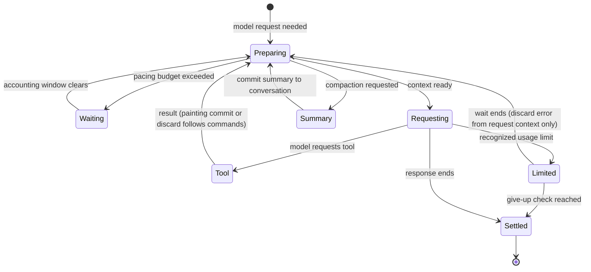

# The painter harness

## Summary

The harness gives the painter six tools: paint, look, note, status, log and read.
It manages which images reach model requests, request pacing and recovery after temporary provider usage limits.
A separate compaction extension replaces older conversation with studio material.
Tools are available before the easel opens; an easel-backed call attempts to open it when needed.

> Technical note: Receipts: `harness/painter/easel-tools.ts:18`, `painter.ts:41`, `compaction.ts:71` and `easel-client.ts:64`. Source paths in this document are relative to the source repository.

## The simple case

The painter reads its studio brief, submits Lua through `paint` and receives printed text followed by `ok`.
It requests a look, sees the returned image and continues with the same canvas and globals.
Ordinary tool replies omit machine compute duration and numbered chunk markers.
Tools run sequentially, including multiple calls from one model message.
Older images may leave later requests while remaining in the session record.

> Technical note: `harness/painter/easel-tools.ts:21`, `easel-client.ts:176` and `painter.ts:92` define these presentation rules. Painting commits belong to [commands](../foundations/commands.md).

## The interaction, event by event

### Starting

The supplied system prompt is retained, minus a leading HTML comment.
Pi's added context files, skills and tool guidelines are removed; its working-directory section remains.
The configured runner selects only paint, look, note, status, log and read. With that launcher restriction, the painter has no shell or general network tool. Loading the extension alone can leave pi’s default tools available; the [runtime probe](../verification/evidence/runtime-harness.md#actual-painter-tools-through-pi) distinguishes these launch modes.
The reader resolves paths and symbolic links, then refuses destinations outside the studio.
This is a tool boundary, not a claim of operating-system sandboxing.

When sitting recovery is enabled, the first input gains the brief, quoted journal, live globals, available painting-time evidence and a fresh whole-canvas image.
Original input images remain alongside it.
This transformation runs once per extension instance.

> Technical note: `harness/painter/painter.ts:42`, `painter.ts:78`, `easel-client.ts:126` and `easel-tools.ts:114` implement these boundaries.

### Ending at once

An outside-studio read or missing file fails without calling the easel.
Invalid harness settings can prevent startup.
A short tool call returns its result without adding a painting chunk unless it invokes `paint`.
Ending a model response does not itself close the easel or artistically finish the painting.

> Technical note: `harness/painter/easel-tools.ts:117`, `context-images.ts:40`, `painter.ts:55` and `compaction.ts:46`; the registered tools contain no close operation.

### Becoming extended

An easel-backed tool checks status and opens the easel if needed.
During a reported rebuild, it polls progress before admitting the requested command.
Invalid progress, failed opening or a stalled rebuild returns an error instead of starting a second easel.
Paint has a twelve-minute client budget; other easel-backed calls have three minutes, including ordinary opening.
An advancing rebuild instead permits thirty minutes without progress and gives the command a fresh ordinary budget afterward.
These are client budgets, separate from the Lua deadline owned by [commands](../foundations/commands.md).

> Technical note: `harness/painter/easel-client.ts:22`, `easel-client.ts:64` and `easel-client.ts:100`; source behavior cases appear in `test/easel-client.test.ts:123` and `test/easel-client.test.ts:160`.

### While extended

Optional pacing estimates the next request from the previous request's reported input usage, including cached tokens.
It delays requests without inserting waiting messages into the conversation.
It is not a maximum request size: an oversized request proceeds once the accounting window is empty.

A recognized temporary usage limit pauses the run, then retries with the failed response omitted from model context.
The original error remains in the session record.
The default wait is the reported reset duration plus one minute, or thirty minutes when none is reported.
After twenty-four hours of consecutive limits, the next give-up check allows settling on the error.
The check happens before waiting, so a long announced reset can extend beyond that nominal period.
Empty credit balances are not treated as temporary usage limits.

> Technical note: `harness/painter/pace.ts:19`, `pace.ts:49`, `painter.ts:121`, `painter.ts:140`, `limits.ts:16` and `limits.ts:59` own this behavior.

### Finishing

A successful paint returns output and `ok`; [commands](../foundations/commands.md) owns rollback and persistence failure.
A tool timeout reports that the easel did not answer and identifies the log as evidence of whether the chunk ran.
Timeout is not proof of discard.
A successful look receives a random filename before pi reads the image.

Compaction assembles studio material without a model summarization call.
It includes the brief, quoted journal, recently assigned live globals, available clock evidence and a fresh canvas-look path.
Later requests insert that saved image after the summary, subject to ordinary image pruning.
It depicts summary time rather than refreshing on every request.
Missing material and unavailable easel responses are stated explicitly.
Unexpected summary failure produces a short fallback naming the brief and journal.

> Technical note: `harness/painter/easel-client.ts:105`, `easel-client.ts:187`, `easel-client.ts:207`, `summary.ts:121`, `compaction.ts:75` and `painter.ts:92`. Chunk-count facts are metadata, not visible summary text.

## Modifiers

| Variant | Set at the start | Changed while extended |
|---|---|---|
| Tool and arguments | Selects paint, look, note, status, log or read. | A later call is separate; accepted arguments remain fixed. |
| Look options | Crop, mode, size, grid and palette follow [looking](../painting/looking.md). | Requires another look. |
| Journal replacement | Replaces an exact passage instead of appending; [journal](journal.md) owns the rules. | Requires another note. |
| Image limits | Defaults are 20 images and 12 million base64 characters per request. | Environment changes do not alter loaded settings. |
| Input-token budget | Enables pacing against a sixty-second accounting window. | Recent usage changes waiting; settings stay fixed. |
| Usage-limit settings | Sets probe seconds and give-up hours. | New provider reset information changes the next wait. |
| Sitting recovery | Adds recovery material to the first input when enabled. | Later inputs do not repeat the initial transformation. |
| Compaction reserve | Default reserve is 100,000 tokens with 20,000 recent tokens retained. | The extension supplies settings for the process. |
| Provider images | OpenAI requests high detail; Gemini requests ultra-high resolution. | Transformation applies to each outgoing payload. |

> Technical note: `harness/painter/context-images.ts:27`, `limits.ts:38`, `compaction.ts:38`, `vision-payload.ts:14` and `painter.ts:53`. The named environment settings are read once and removed. Requested resolution does not prove provider rendering behavior.

## Cancel and interrupt

| Event | Before extended | While extended |
|---|---|---|
| Explicit abort | An already-aborted tool signal prevents launching its client. | Client process group receives termination; an existing background easel may still commit. Pacing listens for abort; usage-limit waiting has no abort listener. |
| Another action | Sequential tools wait their turn. | Another tool does not alter the submitted command; an external caller still shares the easel. |
| Environment failure | Missing executable, files or provider access prevents normal progress. | Tool errors return; recognized limits retry. Other provider failures remain pi's responsibility. Summary failure produces fallback text. |
| Target changed externally | Reads and recovery inspect current studio material. | No atomic snapshot covers brief, journal, globals and image together. Cached summary images are not reread. |
| Input channel changed | Input accepts text and images; tools take structured arguments. | A terminal call does not rewrite the pending tool. Recovery in a new sitting depends on the runner's recovery setting. |

> Technical note: `harness/painter/easel-client.ts:25`, `painter.ts:63`, `painter.ts:111`, `painter.ts:140` and `summary.ts:121`. The unconditional usage-limit timer caused delayed abort in the [runtime probe](../verification/evidence/runtime-harness.md#usage-limit-abort-bug04).

## Interactions with other systems

**Access.** Tools expose the studio reader and easel operations. Easel clients receive PATH, HOME and an optional thread budget. Prompt filtering is separate from file access.

**History.** Pruning changes outgoing context, not stored session images. Usage-limit recovery preserves the original error record. Painting history follows commands.

**Containers.** The studio supplies the executable, brief, notes and painting files. The checked reader refuses a destination outside that root.

**Restricted state.** Rebuilds delay tool admission. Missing globals or images produce explicit degraded recovery material, not invented state.

**Offline.** Easel operations are local; the next model response still needs its configured provider. Generic network failure is not classified as a temporary usage limit.

**Collaboration.** Harness tools run sequentially. The harness adds no painting branch or merge for other callers sharing the easel.

**Notifications.** Tools return errors to the painter. Usage-limit waits print runner-side status. Image-retention counts and compaction settings are session metadata.

**Preferences.** Runner settings apply at startup. If pi's settings interface cannot accept the compaction override, the harness reports that pi's own settings apply.

> Technical note: `harness/painter/easel-client.ts:28`, `painter.ts:110`, `painter.ts:147`, `easel-tools.ts:37`, `summary.ts:137` and `compaction.ts:55` support these concerns.

## Edge cases

- Image pruning drops oldest blocks in groups of five, sometimes keeping fewer images than the ceiling. The newest survives unless it alone exceeds the size limit; an explanation replaces it then.
- A dropped read image can retain a path placeholder. A dropped look-tool image has a generic earlier-look placeholder; surrounding text remains.
- Brief text is bounded at 60,000 characters, quoted journal text at 120,000 and globals at 150 recently assigned names. Full files remain readable.
- The log tool keeps its last 50,000 characters and names the full file when truncated.
- Recovery lists live globals rather than guessing assignments from Lua source. Clock evidence is successful paint output or journal stamps, not a fresh clock query.
- A missing summary image is cached as unavailable. Restoring that path later does not cause this process to reread it.
- Only recognized per-minute quota errors are rewritten for pi's retry handling. Daily quotas and billing errors remain unchanged.

> Technical note: `harness/painter/context-images.ts:66`, `context-images.ts:96`, `summary.ts:12`, `summary.ts:79`, `easel-client.ts:116`, `painter.ts:63` and `pace.ts:59`. Source tests include `test/context-images.test.ts:30`, `test/summary.test.ts:20`, `test/recovery.test.ts:46` and `test/pace.test.ts:38`; these citations do not claim a test run.

## Open questions and verification

Actual external-provider requests and full-duration provider waits remain untested. Installed pi compaction, six-tool execution and usage-limit abort were exercised using local provider fixtures in the [runtime pass](../verification/evidence/runtime-harness.md). The usage-limit timer delayed abort until its configured three-second wait ended.
Tool isolation is not a verified hostile-filesystem security boundary.
Compaction depends on pi's settings interface; its documented fallback changes when compaction occurs.

Source-reviewed against the repository commit `4e525e50897807e9b5f734071dfeb330f1a393d3`; runtime evidence belongs in [verification](../verification/README.md).
