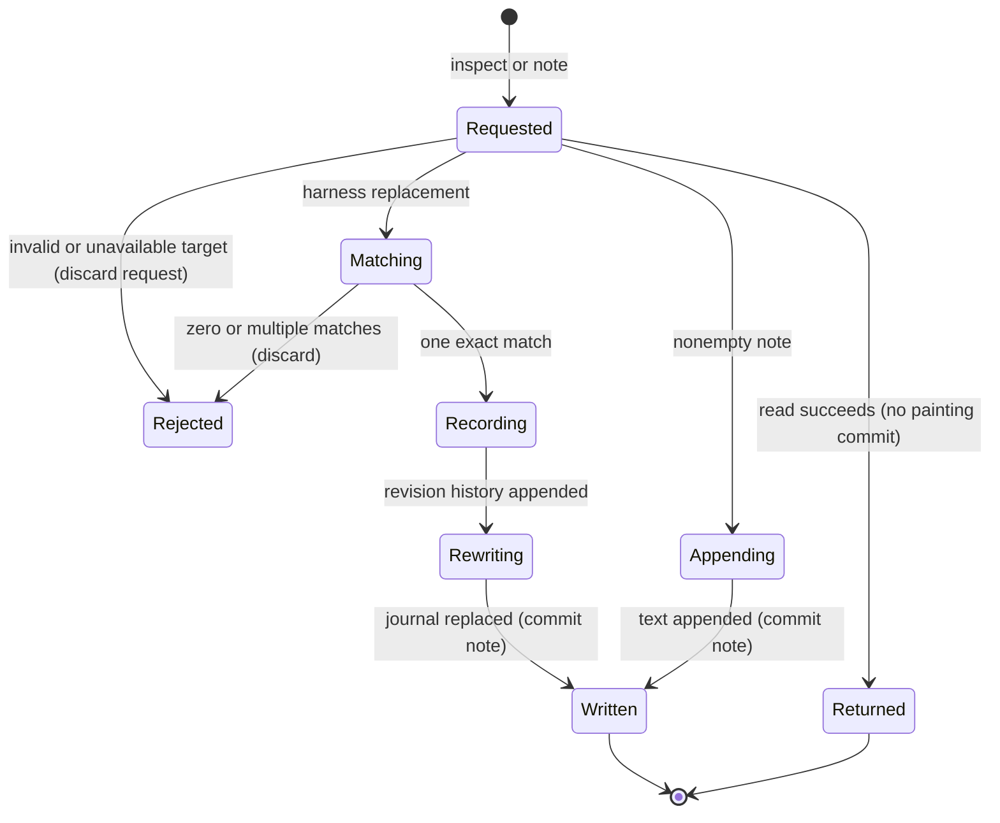

# The journal and inspection commands

## Summary

The painter can inspect setup, globals and the successful log, and keep a separate written journal. Terminal `note` appends; the harness's note tool also supports exact passage replacement. A journal edit changes the notes, not the painting or its no-undo rule.

> Technical note: Receipts: `crates/easel/src/main.rs:216` (journal formatting), `main.rs:254` (append), `main.rs:924` (inspection commands), `crates/easel/src/session.rs:396` (globals) and `harness/painter/journal.ts:17` (revision).

## The simple case

The painter asks for status, reads the current canvas setup and writes a note about the next passage. The note is appended to `notes/journal.md` with painting time. Later, the log shows the successful Lua chunks and globals shows names available to reuse. None of those inspection requests adds a painting chunk.

## The interaction, event by event

### Starting

Status, globals and log address the selected easel session. An append note needs nonempty text and an available session to supply its painting time. Harness replacement instead addresses the studio's journal and requires an exact nonempty old passage.

### Ending at once

An empty append is rejected. A replacement fails when the journal does not exist, the old passage is absent or more than one occurrence matches. The ambiguity error asks for a larger exact passage; it does not choose a match arbitrarily.

### Becoming extended

Inspection gathers its reply. Appending creates the journal directory when necessary and prepares a dated entry. Replacement reads the full journal, checks uniqueness and prepares the replacement and revision record.

### While extended

The caller waits; no editor session is opened. A multiline append keeps continuation lines indented under its dated first line. Replacement does not add a new painting-time heading automatically: its new text replaces exactly the matched passage.

### Finishing

An append writes the entry and returns the journal path. A harness revision first appends a record containing the prior journal, old passage, replacement and wall-clock timestamp, then writes the new journal. This is not an atomic transaction across both files: a write failure can leave the revision record without the completed rewrite. Status and globals return text, and log returns the replayable successful program.

## Modifiers

| Variant | Set at the start | Changed while extended |
|---|---|---|
| Status | Returns chunk count, raster width and canvas setup or no-canvas state. | A queued request observes the state when served. |
| Globals | Lists persistent names with last-assigned chunk and a summary of each value. | It does not provide a live variable inspector during a running chunk. |
| Log | Returns successful source, including log metadata and chunk markers. | A queued request waits behind ordinary running work. |
| Append text | Adds a dated entry; stdin can supply multiline text. | Accepted text does not change when the original input changes. |
| Harness `replaces` | Requires one exact match and allows replacement or deletion via empty new text. | A second caller is not merged into the pending rewrite. |
| Terminal versus harness | Terminal supports append; harness adds revision behavior outside painting Lua. | Switching channel does not turn an append into a revision. |

## Cancel and interrupt

| Event | Before extended | While extended |
|---|---|---|
| Explicit abort | An unsubmitted request changes nothing; queued easel requests can be skipped after disconnect. | A client interruption does not prove an append or revision was undone. |
| Another action | Easel commands queue; harness tools are serialized within their turn. | Separate processes editing the journal have no documented merge transaction. |
| Environment failure | Missing session blocks ordinary easel inspection or append; a missing journal blocks replacement. | File failure returns an error; revision record and journal rewrite can diverge. |
| Target changed externally | Inspection reads the current target; replacement matches the file read at invocation. | An external journal edit between read and write can be overwritten; painting log edits trigger integrity checks. |
| Input channel changed | Inline versus stdin affects how append text is supplied; harness exposes exact replacement. | Pending text and match are not interactively updated. |

## Interactions with other systems

**Access.** Journal operations use filesystem permissions. They do not grant Lua arbitrary file access.

**History.** Notes are separate from painting chunks. Replacement keeps an independent revision history; changing notes cannot erase a painted stroke.

**Containers.** Developer sessions under one root share the root journal. Globals and painting logs remain session-specific.

**Restricted state.** Normal easel inspection is subject to integrity readiness; rebuild has a special status response. Harness journal replacement does not need to execute a paint chunk.

**Offline.** Local inspection and journal file operations need no provider connection.

**Collaboration.** Concurrent journal edits are not reconciled. The serialized easel alone does not protect direct file revisions from another process.

**Notifications.** Success names the journal path. Match failures explain absent or repeated text. Inspection returns text rather than a visual badge.

**Preferences.** Notes are painter-authored content; they do not automatically change simulator settings.

## Edge cases

- Appending after a file without a trailing newline starts the new entry on a new line.
- Whitespace-only append text is rejected.
- A global's recorded assignment chunk is not necessarily the last time an object held by it was mutated.
- An empty painting log can exist before canvas setup.
- Replacing text with itself still follows the revision-writing path.
- Journal append time is painting time; revision metadata uses wall-clock time.

## Open questions and verification

Denied journal rewrite reproduced an appended history record with unchanged journal bytes in the [runtime pass](../verification/evidence/runtime-harness.md#journal-history-before-denied-rewrite-bug06). A [controlled production-helper interleaving](../verification/evidence/matrix-harness.md#concurrent-journal-boundary) reproduced loss of a concurrent revision and append from the current journal. This is a scheduled filesystem interleaving, not a naturally timed race. [Triage](../bug-triage.md) distinguishes them from observed CLI results.

Source-reviewed against the repository commit `4e525e50897807e9b5f734071dfeb330f1a393d3`; see [verification](../verification/README.md).
