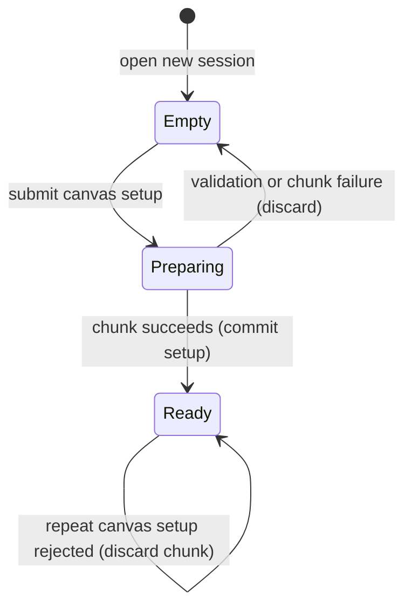

# The canvas and material model

## Summary

A session begins without a canvas. Its first canvas setup chooses physical size, aspect, linen, dry ground and randomness. The painting then has one surface whose materials interact; it is not a stack of editable image layers.

> Technical note: Receipts: `crates/easel/src/api.rs:1210` (canvas), `api.rs:1275` (piles), `api.rs:493` (pile values) and `notes/easel_guide.md:38` (coordinates).

## The simple case

The painter creates a canvas with a width in millimeters, aspect ratio, linen density and one or more ground coats mixed from named tubes. After success, `W` and `H` describe the logical drawing area. The painter mixes a pile, loads a brush and paints on the dry ground.

## The interaction, event by event

### Starting

Canvas setup requires size, aspect, linen and ground. The box already selected for the session supplies ground pigments and future piles. Seed defaults to 1. Unknown setup keys fail instead of silently becoming ignored preferences.

### Ending at once

Missing required values and out-of-range values reject the setup. A second canvas setup is rejected once a canvas exists. An error later in the same chunk also rolls back a newly created canvas under the [command model](commands.md).

### Becoming extended

The easel prepares linen and ground. Ground is already dry when painting begins, and its preparation does not become elapsed painting time. This computation is not an interactive setup wizard.

### While extended

No preview is streamed during preparation. The submitted setup is fixed. The painter cannot resize or change ground halfway through preparation by sending another request.

### Finishing

Success retains the canvas and makes its dimensions available as globals. The whole chunk adds one log entry, even when setup and painting share it. The painting clock begins at day 1, 09:00; [time](../painting/time.md) owns subsequent aging.

## Modifiers

| Variant | Set at the start | Changed while extended |
|---|---|---|
| Size | Physical width from 50 to 5000 mm changes the relation of tools and material texture to the surface. | Setup is fixed; a second canvas call is rejected. |
| Aspect | Width divided by height, from 0.2 to 5, sets canvas shape. | Setup is fixed. |
| Linen | One density or warp/weft pair, each from 4 to 60 threads/cm, sets weave. | Setup is fixed. |
| Ground | Ordered coats use tube mixtures, thickness and application texture. | Setup is fixed. |
| Seed | Sets repeatable preparation and later default randomness. | Lua random reseeding is separate from replacing canvas setup. |
| Pile medium | A new mixture can contain 0 through 0.95 added oil share. | A different mixture is another pile; a pile is not edited in place. |
| Global or local object | Global objects can be reused in later chunks; local objects belong to this chunk's scope. | Assignments remain subject to chunk success. |

## Cancel and interrupt

| Event | Before extended | While extended |
|---|---|---|
| Explicit abort | A disconnected queued request can be skipped. | Client interruption is governed by commands; it does not guarantee preparation stops. |
| Another action | Another request waits. | It cannot resize the preparing canvas; later setup attempts fail once committed. |
| Environment failure | A missing session prevents setup. | Server failure can lose uncommitted preparation; persistence failure is not a clean Lua rollback. |
| Target changed externally | Integrity validation can reject the request. | Log changes can block commit; no supported external canvas editor exists. |
| Input channel changed | The same setup can arrive inline, from file, stdin or the harness. | Accepted source remains fixed. |

## Interactions with other systems

**Access.** Tube names must exist in the selected box. Lua cannot import arbitrary image files as canvas contents through OS access.

**History.** Canvas setup is logged once on success. No resize, clear or undo command replaces the established canvas.

**Containers.** Globals can hold piles, brushes, masks, geometric references and rags. These are not layers that can be reordered.

**Restricted state.** Material and geometry operations that need a canvas fail until setup exists.

**Offline.** Setup and material calculations are local.

**Collaboration.** The session shares one surface and set of globals among its clients.

**Notifications.** Setup success appears in the chunk reply and status; visual inspection requires a look.

**Preferences.** Setup values are painting-specific, not defaults for every later session.

## Edge cases

- Logical width is 1000 units and height is `1000 / aspect`; live output is 2400 pixels wide. Floating-point arithmetic can make printed H slightly different from the exact decimal result, as in [the probe](../verification/evidence/cli.md).
- The upper-left is `(0,0)`; x increases rightward and y downward. Angles use radians, with zero rightward and π/2 downward.
- Ground thickness is 5 through 400 µm per layer; knife, roller and brush application leave different textures.
- Pile parts must be positive finite numbers and name an available tube. Repeated tube entries are combined for mixing.
- Physical paint films can cover or mix with earlier marks, but they are not separately selectable UI layers.
- A pile value can outlive its presence in the recent palette ledger. The guide's “16 piles” wording is examined in triage rather than treated as global-variable deletion.

## Open questions and verification

Extreme aspect ratios and large physical widths are source-backed limits, not all runtime-tested examples. Material appearance depends on thickness, ground and lighting of the rendered model; this document does not claim physical calibration.

Source-reviewed against `../claude-paint` commit `4e525e50897807e9b5f734071dfeb330f1a393d3`; see [verification](../verification/README.md).
