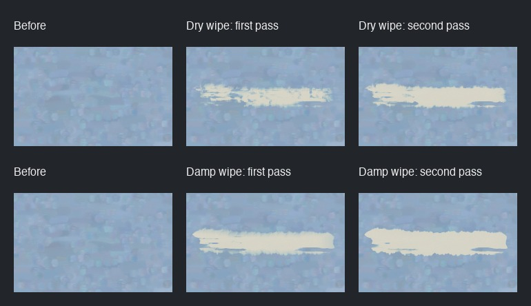

# The rag

Engine 3 adds a cloth for wiping and blotting open paint. Dry wipes leave
broken streaks; a blot leaves a crumpled patch. Spirits help the cloth lift
more paint from the weave's hollows. Set paint stays in place.

```lua
r = rag()                               -- clean cloth, about 40 mm across
r:wipe({{200, 300}, {700, 320}}, {pressure=0.6})
r:blot(450, 260, {pressure=0.5})
r:refold()                              -- turn out a cleaner, dry face
r:dip(0.5)                              -- dampen the face with spirits
r:wipe(rect(200, 200, 500, 200), {passes=2, refold=0.5})
```

The [easel guide](../easel_guide.md#the-rag) describes the options and hand time.

## Handling

Cloth folds miss parts of the surface, so damp wipes retain streaks too.
Wipes have irregular sides and uneven ends. During one wipe, a small share
of freshly lifted paint returns along the lightly pressed rim; that paint
is subtracted from the cloth's load.

A loaded face lifts less. Refolding exposes a cleaner face, limited by how
much the whole cloth has already soaked up. Dampness halves every three
minutes of painting time. The painter can read the cloth's state but cannot
change it by assignment. A failed command restores the rag and canvas.

The cloth lifts open paint, leaves a stain, and cannot remove set paint.
The cloth parameters are estimates, not measured material constants.
Spirits on the rag improve lift and reach; this release does not add thinner
to paint piles or change brush deposition or drying rates.

## Current wipe comparison

Each row shows the same starting patch, then one and two wipes with the
same face. Top: dry cloth. Bottom: cloth dipped in spirits.



## Release checks

The rag's physics checks cover dry and damp wiping, refolding, evaporation,
remaining stain, and leaving set paint untouched. A two-wipe test checks
paint transferred between canvas and cloth while the cloth has spare
capacity; its second damp wipe must clear more color. It does not claim
complete mass accounting through cloth saturation or refolding.

The easel checks cover hand time, rollback, read-only state, and deterministic
replay at 2400 pixels on one and four threads. Engine 1 and 2 logs retain
their existing behavior; eleven small historical cases compare against
unchanged saved images and state digests.

Run `scripts/test --all` for the release checks. The separately approved
`test_candidate` tool tests an exact commit in a fresh checkout before the
approved `merge_candidate` tool publishes it.

Earlier design studies and their replayable inputs are retained in this
folder as historical evidence. They predate the textured wiping changes.
