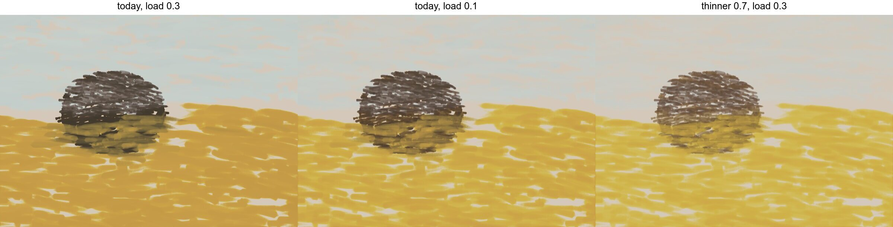
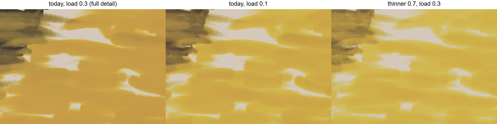

# Thinner (`pile{..., thinner=}`)

Solvent (turpentine, mineral spirits) knifed into a pile, for a lean
lay-in or a thin wash. Review finding 4: `load` alone doesn't thin paint.
Code: `crates/paint/src/thinner.rs`; tests: `crates/easel/src/thinner_tests.rs`.




The same lay-in three times over a toned ground (lead white 4, raw umber
1): a sky (lead white, cobalt, a little ochre), a dark mass (raw umber,
bone black) and a field (ochre, raw sienna, lead white), `broad` and
`body` passes. Left: today, load 0.3. Middle: today, load 0.1 (dry brush:
the paint catches the weave's tops). Right: thinner 0.7, load 0.3
(`lay_in_thinner07_load03.lua`; the others are the same file without
`thinner`, at the load named).

## API

```lua
p = pile{{"raw sienna", 1}, thinner=0.5}            -- 0 (none) to 0.9
q = pile{{"lead white", 4}, {"raw umber", 1}, medium=0.2, thinner=0.3}
print(q)        -- pile(lead white 4, raw umber 1; medium 0.2, thinner 0.3)
print(q.thinner) -- 0.3
```

Out of range or not a number is an error. A pile without `thinner`, or
with 0, paints exactly as before. `look` with `palette: true` shows the
thinned paint.

## What the solvent does, mapped onto what paint already carries

No new canvas state and no checkpoint change. A thinned brushload is a
`Paint` like any other, with one extra field the canvas never stores.

| effect | how | source / status |
|---|---|---|
| less pigment per coat (transparent) | K and S per coat × (1 − t), as medium's | the solvent evaporates; the dry film is (1 − t) of the wet. Two-constant KM |
| fluid, keeps fewer brush marks | stiffness × (1 − t)², as medium's | oil_paint_physics.md §1: striations survive only above ~100 Pa yield stress; bob_ross.md: "thinner lowers yield stress". The exponent is an estimate |
| spreads further per load | a bristle carrying solvent share t runs `run / (1 − t)` (`bristle::run_of`) | estimate. The solvent share rides on each bristle (mixed by volume, 0 for paint lifted off the canvas) |
| oil cures as the pile's own oil | the drying rate undoes `drying::rate`'s fat term for the lower stiffness, no more | the solvent's fluidity isn't oil. Any speed-up comes from the thinner film through the engine's thickness law (time ∝ film^0.7, floored at ~0.37 coats), so it is a factor on the engine's constants, at most 2× against one coat |

Not modeled: the solvent flashing off within minutes (a matte, stiffer
film), and the wet film shrinking as it leaves. The canvas keeps the
volume the brush laid.

Period receipts: Hopper began "with almost pure turpentine" [MORSE,
hopper_materials.md]. Sargent's lay-in was "thinned with a little
turpentine" [CH pp.181–182, sargent_materials.md]. Inness's transparent
start was "thinned with a vehicle—turpentine and Siccatif" [MAN p.32,
inness_materials.md].

## Numbers (live width 2400, `thinner_table`)

A strip of each (load, thinner) over a 60-day-dry card: the Inness-box
toned ground, a black band (bone black) and a white band (lead white).
"Share of masstone" is how far the strip's mean color moved from what was
under it toward the pile's masstone, in linear RGB. "Card contrast
showing" is the share of the black/white luminance difference that still
shows through (1 = untouched, 0 = hidden).

`body` hand:

| pile | load | thinner | share of masstone over the ground | over black | over white | card contrast showing |
|---|---|---|---|---|---|---|
| lead white 6, yellow ochre 1 | 0.1 | 0 | 62% | 68% | 76% | 33% |
| lead white 6, yellow ochre 1 | 0.1 | 0.3 | 39% | 55% | 60% | 47% |
| lead white 6, yellow ochre 1 | 0.1 | 0.5 | 30% | 43% | 36% | 60% |
| lead white 6, yellow ochre 1 | 0.1 | 0.7 | 14% | 22% | 17% | 79% |
| lead white 6, yellow ochre 1 | 0.3 | 0 | 90% | 96% | 91% | 5% |
| lead white 6, yellow ochre 1 | 0.3 | 0.3 | 79% | 82% | 88% | 18% |
| lead white 6, yellow ochre 1 | 0.3 | 0.5 | 67% | 76% | 74% | 26% |
| lead white 6, yellow ochre 1 | 0.3 | 0.7 | 37% | 53% | 50% | 49% |
| lead white 6, yellow ochre 1 | 0.6 | 0 | 97% | 99% | 98% | 1% |
| lead white 6, yellow ochre 1 | 0.6 | 0.3 | 95% | 96% | 99% | 3% |
| lead white 6, yellow ochre 1 | 0.6 | 0.5 | 87% | 93% | 91% | 8% |
| lead white 6, yellow ochre 1 | 0.6 | 0.7 | 68% | 77% | 79% | 25% |
| raw sienna | 0.1 | 0 | 68% | 37% | 66% | 45% |
| raw sienna | 0.1 | 0.3 | 62% | 28% | 53% | 61% |
| raw sienna | 0.1 | 0.5 | 49% | 16% | 43% | 74% |
| raw sienna | 0.1 | 0.7 | 30% | 7% | 25% | 88% |
| raw sienna | 0.3 | 0 | 90% | 78% | 91% | 10% |
| raw sienna | 0.3 | 0.3 | 80% | 59% | 83% | 22% |
| raw sienna | 0.3 | 0.5 | 72% | 44% | 73% | 37% |
| raw sienna | 0.3 | 0.7 | 50% | 20% | 49% | 68% |
| raw sienna | 0.6 | 0 | 95% | 91% | 97% | 4% |
| raw sienna | 0.6 | 0.3 | 91% | 84% | 88% | 12% |
| raw sienna | 0.6 | 0.5 | 86% | 67% | 85% | 18% |
| raw sienna | 0.6 | 0.7 | 69% | 41% | 71% | 40% |

`scumble` hand (short strokes worked back and forth, so more paint per
area): at load 0.3, the lead-white mix goes 99/97/91/69% of the way to
masstone at thinner 0/0.3/0.5/0.7, and raw sienna 99/96/90/76%. At load
0.6 both stay at 93–100%. Full table: run `thinner_table`.

Pigment laid by one `body` pass over a 400-unit square, measured on the
open paint (wet film × scattering per coat). Both piles give the same
ratios:

| load | thinner | wet film | pigment, share of the unthinned pass | (1 − t) |
|---|---|---|---|---|
| 0.3 | 0 / 0.3 / 0.5 / 0.7 | 42.1 / 34.9 / 28.6 / 20.2 µm | 1 / 0.58 / 0.34 / 0.14 | 1 / 0.7 / 0.5 / 0.3 |
| 0.6 | 0 / 0.3 / 0.5 / 0.7 | 95.0 / 79.9 / 66.2 / 47.6 µm | 1 / 0.59 / 0.35 / 0.15 | 1 / 0.7 / 0.5 / 0.3 |

Drying. A `body` pass at load 0.6 over a 400-unit square, from the end of
the pass. The time is when 13 of 25 points read `setting`, and when they
read `tacky` (past the gel point, `GEL` in drying.rs):

| pile | thinner 0 | 0.3 | 0.5 | 0.7 |
|---|---|---|---|---|
| lead white 6, yellow ochre 1: setting / tacky (min) | 135 / 295 | 120 / 260 | 100 / 230 | 75 / 180 |
| raw sienna: setting / tacky (min) | 255 / 550 | 230 / 485 | 195 / 430 | 155 / 335 |

A thinned film reaches the gel point 1.13× (thinner 0.3), 1.28× (0.5) and
1.6× (0.7) sooner, for both piles. These are factors on whatever the
engine's drying constants are.

## Targets, set from the physics before measuring, and what happened

1. **The dry film is (1 − t) of the wet.** A thinned pass lays at most
   (1 − t) of the unthinned pass's pigment per area. **Met:** 0.58 / 0.34 /
   0.14 against 0.7 / 0.5 / 0.3 (`thinned_paint_lays_less_pigment`).
2. **Raw sienna, a transparent earth, thinned half is an imprimatura:**
   at least half the card's contrast shows through at loads 0.3 and 0.6.
   **Not met.** At width 600 (the test): 0.49 and 0.20. At 2400: 0.37 and
   0.18. Thinned 0.7 at load 0.3: 0.68. The test
   `an_earth_thinned_half_is_an_imprimatura` is live and fails. Why: the
   pass already lays 0.34 of the unthinned pigment, under (1 − t). But
   raw sienna's tube hiding (0.4 per 25 µm coat, an unchanged constant)
   means about one coat of it hides 75–80% of a black/white card. A load-0.6
   `body` pass lays 95 µm wet, and a third of that pigment is still about
   1.3 coats of tube sienna. Showing half the card would take about a
   tenth of the pigment, below even (1 − t)² = 0.25. Nothing in the
   physics or in the sources supports that, so I didn't tune the spread to
   reach it. An imprimatura in this engine is thinned *and* thinly laid:
   thinner 0.7 at load 0.3, or any thinner at load 0.1.
3. **Lead white is a scumble, not a glaze.** Thinned half at load 0.6,
   it still hides at least half the card, and less than unthinned. More
   solvent, less hidden. **Met:** 8% of the card shows (87% of masstone).
   Thinned lead white stays a scumble at ordinary loads.
4. **Thinned paint sets sooner, moderately, never in minutes.** It is
   tacky in under 0.8× the time and at least 1/2.5 of it
   (`a_thinned_film_sets_sooner`). **Met:** 1.28× and 1.6×.

Findings along the way:

- **A uniform-film bound was the wrong target.** I first bounded hiding
  by inverting the unthinned pass into a uniform KM film and thinning that
  by (1 − t). The thinned passes broke this bound even when they laid only
  0.31 of the pigment. A broken pass hides differently from a uniform film
  of the same pigment, so the bound isn't physical. It was replaced by
  target 1, which measures the pigment directly.
- **The first drying model was wrong.** It sped the cure as if the dry
  film were (1 − t) thick, on top of the thinner film the canvas already
  saw. Thinned lead white went tacky inside a 39-minute pass. Now the oil
  cures as the pile's own oil (table above).
- **The measurements depend on resolution.** The same strips at width 600
  and 2400 differ by up to 12 points (raw sienna load 0.3 thinner 0.5:
  49% vs 37% of the card showing). The tests run at 600 for time; the
  tables above are at 2400.

## The open window (review finding 3), not changed

`GEL = 0.15` (drying.rs) is marked "Estimate". With it, a load-0.6 `body`
pass of lead white 6 / ochre 1 (95 µm wet) is "setting" 135 min after
the pass and tacky (unliftable) at 295 min. The review measured a
one-coat lead-white sky open to about 100 min and tacky at 210. The
repo's sources give touch-dry times (thin lead-white films 1–3 days,
notes/drying.md; a 250 µm titanium film 4–6 days,
oil_paint_physics.md §3) but nothing for the gel point. The one period
account of a fast set is of paint thinned with turpentine *and a
siccative*: Inness's transparent start "set or grew tacky" within "one
continuous sitting" [MAN pp.32–34]. The thinner shortens the window by
1.13–1.6× on top of whatever `GEL` gives. If the window grows (the
drying branch's engine 3), these factors still hold.
