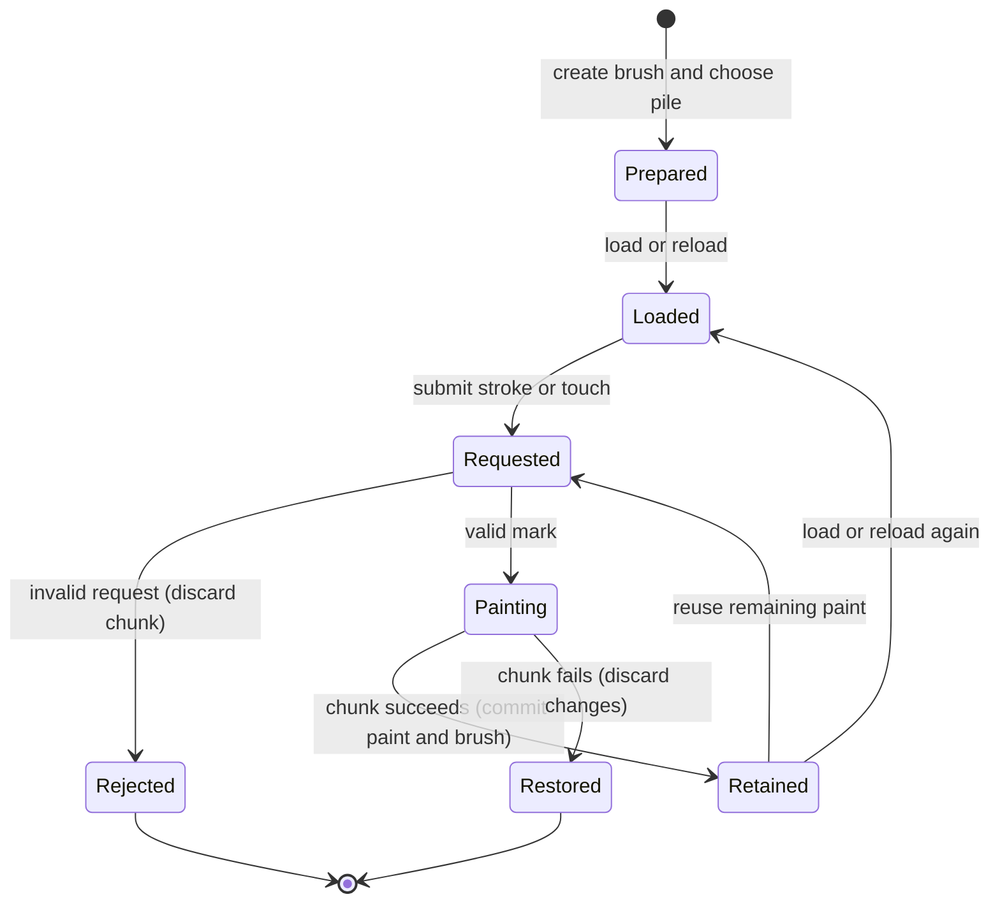

# The held brush

## Summary

A held brush carries paint between marks and successful chunks.
The painter creates it with `brush`, loads a pile and uses `stroke` for a path or `touch` for a pressed tip.
It has no on-canvas selection outline or live cursor.
Printing the brush reports its kind, width and fullness; a look reveals the mark.
Painting requires the [canvas](../foundations/canvas.md) and a ready [session](../foundations/sessions.md).

> Technical note: [api.rs](../../claude-paint/crates/easel/src/api.rs):371–470 defines held brush operations and their printed form; :1406–1419 creates brushes.

## The simple case

The painter creates a filbert, loads a mixed pile and submits a path with at least two points.
The brush lays paint along that path, using the supplied start and end pressure.
It retains the paint left after the stroke and can pick up paint already on the canvas.
A later stroke from that brush therefore continues its material history.
Reloading removes most remaining paint before adding another load.
After the chunk succeeds, the painter can inspect the result with a [look](looking.md).

> Technical note: [easel_guide.md](../../claude-paint/notes/easel_guide.md):110–138 describes the public brush behavior. [smoke.rs](../../claude-paint/crates/easel/tests/smoke.rs):41–64 exercises loading and repeated strokes in a successful session.

## The interaction, event by event

### Starting

The painter chooses a kind and a positive finite width in canvas units.
The kinds are round, flat, filbert, fan, rigger, badger and stippler.
The table form can customize the tool's shape and material handling.
A new brush starts empty; loading adds paint to what is already in it.
A global brush remains available for later chunks.
Two variables referring to the same brush share its paint.
Creating a new brush from an existing brush copies its tool shape into a new empty brush.

> Technical note: [api.rs](../../claude-paint/crates/easel/src/api.rs):309–353 accepts tool forms and aliases; :371–375 shares held state; :1409–1417 creates a fresh holder. [bristle.rs](../../claude-paint/crates/paint/src/bristle.rs):348–419 initializes empty reservoirs.

### Ending at once

Creating or inspecting a brush does not itself leave a mark.
`fullness()` reports remaining paint relative to a full load.
`mark_width(pressure)` estimates the tool's mark width, and `pressure_for(width)` finds a pressure for a requested width.
A stroke with fewer than two points fails.
Unknown stroke or touch option names fail, rather than silently altering the mark.
Any uncaught error follows the whole-chunk [rollback rules](../foundations/commands.md).

> Technical note: [api.rs](../../claude-paint/crates/easel/src/api.rs):404–418 and :445–446 define inspection and rejection; [bristle.rs](../../claude-paint/crates/paint/src/bristle.rs):289–311 defines width estimation.

### Becoming extended

A stroke follows its submitted points; a touch presses at one submitted position.
Neither waits for a mouse release.
The submitted options are fixed while that operation computes.
A brush can add paint, carry picked-up paint onward and affect existing workable paint.
Clipping restricts the painted footprint to the supplied mask.
The meaning of canvas coordinates belongs to [canvas](../foundations/canvas.md), and mask construction belongs to [shapes](shapes.md).

### While extended

Stroke pressure changes from the chosen starting value to the ending value.
Ramps describe the press-down and lift-off portions.
Swell varies pressure along the path; shake changes its unsteadiness.
Orientation holds the brush across the path, along it or at a fixed angle.
A touch can drag and twist as it presses.
No intermediate image arrives automatically; the painter receives the command result when the chunk finishes.

> Technical note: [api.rs](../../claude-paint/crates/easel/src/api.rs):409–465 maps mark options to canvas operations. [bristle.rs](../../claude-paint/crates/paint/src/bristle.rs):473–520 and :1455–1490 define stroke and touch parameters.

### Finishing

A successful chunk retains both the altered canvas and the brush's remaining paint.
It creates one log entry for the chunk, not one entry per stroke.
An error later in that chunk restores earlier brush changes along with the painting under [commands](../foundations/commands.md).
There is no undo step for an individual mark.
The next stroke uses the retained brush unless the painter explicitly loads, reloads, wipes or replaces it.

> Technical note: [determinism.rs](../../claude-paint/crates/easel/tests/determinism.rs):95–137 includes held brushes in replay state checks. Transaction ownership and failure receipts are in [commands](../foundations/commands.md).

## Modifiers

| Variant | Set at the start | Changed while extended |
|---|---|---|
| Kind and width | Choose the tool shape and nominal width. | The running mark keeps its tool. |
| Table tool options | Set length, stiffness, hair, run, lay, pickup, push, splay, ragged, point and bristles. | Requires another brush; no brush setter is exposed. |
| Load | Adds the pile to retained paint; default amount is 0.8. | Another load is a later operation in the chunk or a later chunk. |
| Reload | Removes 85% of retained paint, then adds the requested load. | Does not retroactively change a running mark. |
| Wipe | Removes the chosen fraction, default 0.85; does not wipe the canvas. | A later wipe changes subsequent marks. |
| Point | A pointed round or rigger narrows under light pressure and spreads when pressed. | Pressure can vary through the submitted stroke. |
| Stroke pressure | Start/end pair controls the pressure progression. | Follows the submitted progression. |
| Ramps, swell and shake | Control lifting, pressure variation and unsteadiness. | Follow the submitted settings. |
| Orientation | Across, along or a fixed angle controls the brush axis. | Fixed by the submitted mark. |
| Touch pressure, drag, twist and angle | Control the pressed mark and its small movement. | Follow the submitted settings. |
| Clip mask | Restricts the mark to mask coverage. | The accepted operation retains its mask. |
| Existing wet paint | Can enter the brush and affect later marks. | Changes through the submitted painting operation. |

## Cancel and interrupt

| Event | Before extended | While extended |
|---|---|---|
| Explicit abort | A disconnected queued request can be skipped. | Stopping the client does not guarantee rollback; commands owns cancellation. |
| Another action | Another ordinary request waits. | It cannot change this brush midway through the running chunk. |
| Environment failure | An unavailable session prevents painting. | Server or persistence failure follows commands; it is not necessarily clean rollback. |
| Target changed externally | Session integrity can reject the request. | External log changes can prevent persistence; they are not brush edits. |
| Input channel changed | Terminal and harness submit the same brush operations. | A new request does not alter accepted source. |

The brush remains changed after success and returns to its prior state after ordinary chunk rollback.
A lost reply leaves the caller uncertain whether painting committed; resubmission can paint again.

## Interactions with other systems

**Access.** The current tube box supplies the pile's pigments; loading takes a pile, not an arbitrary image or OS file.

**History.** Brush state persists with successful chunks. There is no separate brush undo history.

**Containers.** The brush belongs to the session. A global reference preserves it for later chunks; an alias shares the same held paint.

**Restricted state.** A brush can be constructed before canvas setup, but loading needs the canvas's material style and marking requires the canvas.

**Offline.** Brush simulation runs locally without a model request.

**Collaboration.** Clients targeting the same session share its brush globals and serialized command stream.

**Notifications.** Operations return through the chunk reply. Explicit printing exposes fullness; a look exposes painted appearance.

**Preferences.** Tool choices are stored on each brush. They do not become default tools for every later brush.

> Technical note: [api.rs](../../claude-paint/crates/easel/src/api.rs):569–586 rejects extra loading arguments and remixes the pile using canvas style. Session-wide concerns follow [commands](../foundations/commands.md).

## Edge cases

- Loading adds to remaining paint; it does not set fullness to the requested amount.
- Reloading leaves a residue. It is not a perfectly clean color change.
- Wiping clamps its fraction to zero through one. A full wipe empties the brush without altering the canvas.
- Brush wiping does not dirty a held [rag](rags.md): no rag is passed to this operation.
- Successive dips into the same pile can vary slightly in mixture.
- Stroke defaults are pressure 0.8 at both ends, orientation across, ramps 0.08 and 0.15, and shake 1.
- Touch defaults are pressure 0.6 with zero drag, twist and angle.
- Fullness is a relative amount, not a guaranteed bounded gauge: repeated loads can exceed one.
- Tool aliases include sable for round, hog for flat, liner for rigger and blender for badger.
- A pile carries its medium. An extra loading argument for medium is rejected.

> Technical note: [bristle.rs](../../claude-paint/crates/paint/src/bristle.rs):426–458 defines additive loading, clamped wiping and fullness; :488–490 and :1468–1470 own defaults. [api.rs](../../claude-paint/crates/easel/src/api.rs):398–402 wipes without a rag object; :576–585 handles medium and mixture variation.

## Open questions and verification

- All behaviors here are source-reviewed; no manual brush pass is claimed.
- Suspected documentation defect: the guide labels fullness as 0–1, but additive loading and the unclamped fullness calculation allow values above one. The intended upper bound needs a product decision.
- Loading accepts its numeric amount without an explicit zero-through-one check. Negative, excessive and nonfinite values need focused verification before their resulting marks or errors can be described.
- Visual comparisons of points, bristle options, clipping, pickup and dry-paint contact remain unverified.

Source-reviewed against `../claude-paint` commit `4e525e50897807e9b5f734071dfeb330f1a393d3`; runtime verification is recorded separately in [verification](../verification/README.md).
