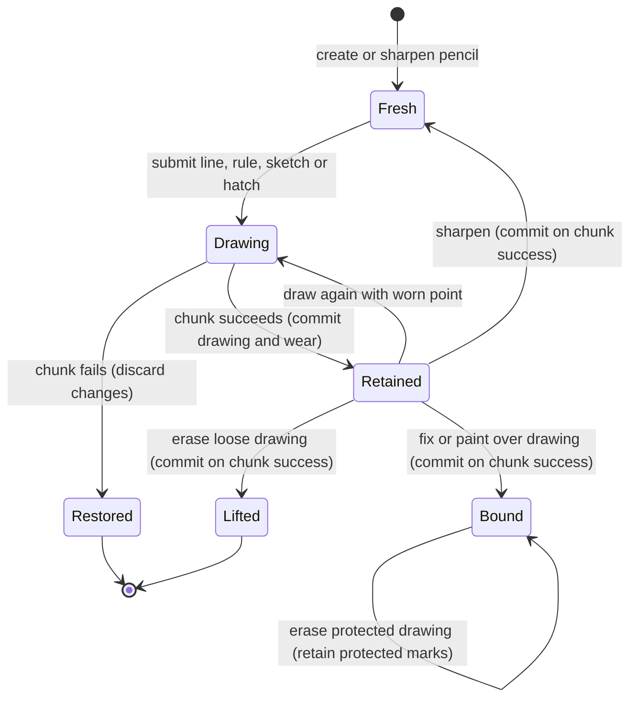

# The pencil and chalk drawing

## Summary

Pencils and black chalk draw on the canvas ground without loading a paint pile.
Their points wear as lines are drawn and can be sharpened again.
The painter uses line, rule, sketch or hatch methods, then can lift loose drawing with an eraser or bind it with fixative.
A drawing guide exposes the drawn geometry as a mask for painting.
These operations need a ready canvas, except creating or sharpening a pencil.

> Technical note: [draw_pencil.rs](../../claude-paint/crates/easel/src/draw_pencil.rs):1–7 and :87–329 define the Lua surface. [graphite.rs](../../claude-paint/crates/paint/src/graphite.rs):1–24 describes the drawing model.

## The simple case

The painter creates a 2H pencil and sketches a path with several light passes.
The line catches the canvas texture rather than covering it uniformly.
A later line from the same pencil uses its worn point.
Sharpening restores the fresh width for subsequent marks without changing existing lines.
The painter can erase an unwanted region, leaving a faint remnant, or fix the drawing before adding paint.
Thin paint can let drawing show through; opaque body paint hides it.
A [look](looking.md) shows the combined drawing and painting.

> Technical note: [easel_guide.md](../../claude-paint/notes/easel_guide.md):281–302 describes the intended sequence. [graphite.rs](../../claude-paint/crates/paint/src/graphite.rs):959–1013 tests erasing, fixing and paint coverage.

## The interaction, event by event

### Starting

`pencil()` defaults to HB graphite; a grade string or a table selects another grade.
Grades run from 9H through H, F, HB and B through 9B.
`chalk()` and a pencil table with kind chalk create black chalk.
Graphite softness changes darkness, sheen and rate of point wear; chalk is broad, matte and crumbly.
No pile or color argument is required.
A global pencil survives later chunks, and aliases refer to the same wear state.

> Technical note: [draw_pencil.rs](../../claude-paint/crates/easel/src/draw_pencil.rs):20–31 and :228–263 validate constructors. [graphite.rs](../../claude-paint/crates/paint/src/graphite.rs):64–130 defines grades and physical width.

### Ending at once

An unknown grade, kind or option key fails.
A line or sketch requires at least two points; a rule requires two separate single-point arguments.
An empty pressure profile is rejected.
Hatching rejects spacing or length that is not positive.
Printing a pencil reports its kind or grade and millimeters worn; `width()` reports its current nominal width in canvas units.
`sharpen()` resets wear to zero and leaves the canvas unchanged.

> Technical note: [draw_pencil.rs](../../claude-paint/crates/easel/src/draw_pencil.rs):38–53, :92–124, :139–142, :183–185 and :194–225 own validation and inspection.

### Becoming extended

The submitted path and options are converted into marks before deposition.
A line follows the points, smoothly by default, with slight hand tremor unless ruled.
A rule follows a straight path with no hand tremor.
A sketch lays repeated searching passes; hatching lays short parallel marks within the supplied region.
The command does not wait for pointer movement or release.
No intermediate drawing image is streamed.

### While extended

Pressure controls contact with the canvas texture: lighter drawing catches the tops, while greater pressure reaches further into hollows.
Line and rule pressure can be constant or a sequence along the path.
The point grows wider as distance is drawn.
Wet paint does not accept the graphite deposit; the drawing skips it.
Drawing is a separate dry deposit, not a brush carrying pigment from a pile.
The submitted options cannot be changed by another client while this chunk runs.

> Technical note: [draw_pencil.rs](../../claude-paint/crates/easel/src/draw_pencil.rs):55–72 updates wear after drawing. [graphite.rs](../../claude-paint/crates/paint/src/graphite.rs):510–530 defines wet-paint skipping and width progression.

### Finishing

Drawing methods return millimeters drawn and retain the updated wear after chunk success.
Several marks in one chunk still create one log entry.
Ordinary chunk rollback restores both canvas changes and the pencil's state.
Persistence failures and rebuilds retain the distinctions in [commands](../foundations/commands.md).

Erasing lifts loose drawing within a mask or a soft path-shaped footprint.
Fixing binds the currently present drawing over the whole canvas or where a mask exceeds half coverage.
Fixing does not prevent new drawing; it protects the existing amount from later erasing.
A drawing guide returns a new mask of continuous line geometry, including areas later covered by paint.

> Technical note: [draw_pencil.rs](../../claude-paint/crates/easel/src/draw_pencil.rs):1–7, :194–216 and :266–329 define wrapper state and finishing operations. [session.rs](../../claude-paint/crates/easel/src/session.rs):207–210 restores the Lua heap; :1198–1205 tests protected pencil methods. [graphite.rs](../../claude-paint/crates/paint/src/graphite.rs):663–717 defines fixative thresholds and the guide.

## Modifiers

| Variant | Set at the start | Changed while extended |
|---|---|---|
| Grade or chalk kind | Chooses deposit and wear behavior; graphite defaults to HB. | Running marks retain the chosen lead. |
| Existing wear | A worn point starts wider; sharpening resets it. | Drawing increases wear through the submitted operation. |
| Line pressure | Number or nonempty sequence; default 0.5. | Follows the submitted profile. |
| Smooth | True rounds the path; false retains corners. | Accepted path stays fixed. |
| Ruler | Removes hand tremor from a line; rule is straight by construction. | Requires another operation to change. |
| Tremor | Controls hand sway in canvas units for line and sketch. | Accepted value stays fixed. |
| Sketch pressure and passes | Scalar pressure defaults to 0.3; pass count defaults to three. | Executes the planned passes. |
| Sketch wander | Controls separation of repeated passes in canvas units. | Accepted value stays fixed. |
| Hatch angle, spacing and length | Set direction and spacing of short parallel marks within a mask. | Accepted values stay fixed. |
| Hatch pressure | Scalar pressure defaults to 0.45. | Applied to planned marks with their hand variation. |
| Seed | Repeats supported hand variation for the same inputs and state. | Does not retarget existing marks. |
| Erase mask or path | Mask selects coverage; a path uses a soft eraser footprint. | Accepted target stays fixed. |
| Erase strength and width | Strength controls lifting; width affects a path, not a supplied mask. | Accepted values stay fixed. |
| Fix mask | Protects existing drawing where coverage exceeds 0.5; omission targets all drawing. | Accepted target stays fixed. |
| Existing paint | Wet paint blocks deposit; paint over drawing protects that drawing from erasing. | Depends on operations already performed in the submitted chunk. |

## Cancel and interrupt

| Event | Before extended | While extended |
|---|---|---|
| Explicit abort | A disconnected queued request can be skipped. | Client interruption does not guarantee server rollback; commands owns cancellation. |
| Another action | Another ordinary request waits. | It cannot sharpen the pencil or change drawing during the accepted chunk. |
| Environment failure | A missing session prevents acceptance. | Process and persistence failures follow commands; they are not necessarily clean rollback. |
| Target changed externally | Integrity validation can reject the request. | External log changes can block commit; they are not an eraser or pencil edit. |
| Input channel changed | The same methods work through terminal chunks or the harness. | Changing caller does not alter accepted source. |

After success, the drawing and pencil wear remain available.
After ordinary rollback, the old drawing, fixative state and pencil table are restored.
A lost reply is not proof that the marks were discarded.

## Interactions with other systems

**Access.** Drawing uses built-in graphite and black chalk; it does not need a tube from the painting's box.

**History.** Drawing, erasing, fixing and sharpening belong to their enclosing chunk. The eraser is another material action, not undo.

**Containers.** The session's globals can retain pencils and guide masks. Guide masks are snapshots of geometry, not live drawing selections.

**Restricted state.** Width inspection, drawing, erasing, fixing and guide creation require a canvas. Fixed or painted-over drawing resists erasing.

**Offline.** Drawing and erasing run locally.

**Collaboration.** Clients targeting one session share pencil tables and canvas state through serialized chunks.

**Notifications.** Drawing returns distance; printing exposes wear. A look reveals appearance, while the guide supplies geometry for later operations.

**Preferences.** Grade and wear belong to each pencil. Per-call path settings do not change every later pencil's defaults.

## Edge cases

- Grade recognition ignores surrounding whitespace and letter case.
- Sketch pass counts are clamped to 1–12, then converted to a whole count. Sketch pressure is a scalar, unlike line and rule profiles.
- Default tremor corresponds to 0.15 mm, and default sketch wander to 2 mm. Explicit values are canvas units and negative values become zero.
- Default hatch angle is -0.9 radians, spacing is the larger of 1.5 mm expressed in canvas units and 2.5 units, and length is 12 mm expressed in canvas units.
- Erase strength defaults to 0.9 and is clamped to zero through one.
- Path erasing defaults to a 4 mm width; explicit width is at least 0.1 canvas units. A single point creates a small pressed footprint.
- The eraser leaves a ghost of loose drawing. It does not lift paint; [rags](rags.md) owns paint lifting.
- `erase` and `fix` do not advance hand time through the drawing-time wrapper; drawing methods do. [Time](time.md) owns clock behavior.
- Fixing or erasing a canvas without drawing has no drawing to change. Its guide is an empty mask.
- Guide coverage can fade with pressure. It is continuous through canvas grain, not necessarily one everywhere along every light line.
- Paint covering the drawing leaves its guide unchanged. Erasing can reduce unfixed guide geometry even where overlying paint prevents a visible erasure.
- Fixative also protects existing guide coverage; later added drawing above that protected amount can still be lifted.

> Technical note: [graphite.rs](../../claude-paint/crates/paint/src/graphite.rs):64–87, :623–681 and :700–717 define grade normalization, guide erasure and fixing. [draw_pencil.rs](../../claude-paint/crates/easel/src/draw_pencil.rs):75–83, :143–151, :177–185 and :266–315 own defaults and timing routes.

## Open questions and verification

- This document is source-reviewed; no manual drawing pass is claimed.
- Selected grades, pressure and chalk marks were inspected in the [runtime atlas](../verification/evidence/runtime-paint.md); the complete option matrix remains unverified.
- Confirmed documentation mismatch in the [runtime probe](../verification/evidence/runtime-paint.md): `drawing_guide` is described as one on a line in the wrapper comment, while the engine explicitly preserves lighter coverage for light drawing. The guide's continuous geometry must not be mistaken for a uniformly full-strength selection.
- The visible drawing and unfixed guide can diverge when erasing over paint. Whether this is the desired behavior needs a product decision; the engine erases the guide before checking whether paint protects visible drawing.
- Exact hatch edge behavior and extreme or nonfinite input values remain unverified.

Source-reviewed against `../claude-paint` commit `4e525e50897807e9b5f734071dfeb330f1a393d3`; runtime verification is recorded separately in [verification](../verification/README.md).
