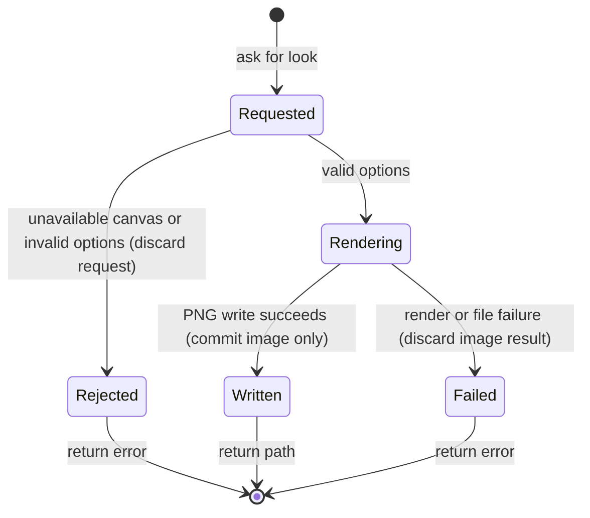

# The look

## Summary

A look produces a PNG of the current painting or the piles held in global variables.
It changes the view without changing the paint.
The terminal returns the image path and dimensions; the painter tool can return the image itself.
A look is reached through `look`, or after a successful chunk with `do --look`.
It needs an open, ready session and, for a canvas look, an initialized canvas.

> Technical note: Source receipts: `crates/easel/src/main.rs:879` (`look`), `crates/easel/src/look.rs:40` (options) and `harness/painter/easel-tools.ts` (tool presentation).

## The simple case

The painter asks for a look after a successful painting chunk.
The easel renders the whole current canvas, writes a new PNG and returns its path.
The painter sees wet paint as it lies now, including earlier drawing and ground.
The next painting command continues with the same paint, held tools and clock.
A look is not a save point that can be restored or undone.

## The interaction, event by event

### Starting

The request targets the session selected by the [session model](../foundations/sessions.md).
The easel checks session integrity before handling it.
The request captures crop, modes, size and grid options.
Palette mode selects a different image and rejects combinations with the other view options.
The browser viewer's image enlargement is a separate action described in [Studio viewer](../watching/studio.md).

### Ending at once

An unknown option or mode returns an error.
A missing canvas prevents a canvas image.
A bad crop is rejected by rendering validation.
These errors do not create a painting chunk or advance the painting clock.
An invalid follow-up look after `do --look` does not roll back the already committed chunk.

### Becoming extended

A valid request begins rendering.
The options are fixed for this request.
The terminal waits rather than displaying individual scan lines.
The session handles ordinary commands sequentially, so a painting request cannot change the canvas halfway through this rendering.

### While extended

Value mode shows brightness in gray.
Squint mode blurs the picture.
Mirror mode reverses left and right.
Modes can combine.
The grid is drawn on the image, never painted onto the canvas.
Its coordinates remain canvas coordinates even when the image is mirrored.
Changing an option requires another request.

### Finishing

A successful ordinary look writes a newly numbered PNG without replacing an older look.
The reply names the image and its dimensions.
No undo record or successful painting chunk is added.
A file-write failure is returned as a look error.
When looking follows a successful chunk, a look failure appears as a warning alongside that chunk's success.
Frame capture uses its own output path; [delivery](../delivery/replay.md) owns that behavior.

> Technical note: `crates/easel/src/main.rs:761` creates look files exclusively and removes an incomplete file after a write error; `main.rs:935` handles post-commit frame and look failures.

## Modifiers

| Variant | Set at the start | Changed while extended |
|---|---|---|
| Whole canvas | Shows the complete canvas scaled to the requested long side. | Requires a new look; the pending render keeps its options. |
| Crop | Two opposite corners select a detail window. Reversed corners are normalized. | Requires a new look. |
| Value or gray | Converts the rendered view to gray. | Requires a new look. |
| Squint or blur | Blurs the rendered view. | Requires a new look. |
| Mirror | Flips the view horizontally. | Requires a new look. |
| Combined modes | Applies the selected transformations to one image. | Requires a new look. |
| Grid | Adds a labeled coordinate grid, with automatic or explicit spacing. | Requires a new look. |
| Size | Sets the whole-view long side within the rendering bounds below. Crops retain native detail. | Requires a new look. |
| Palette | Shows globally held piles; other look options are rejected. | Requires a new look. |
| `do --look` | Looks only after the chunk succeeds. | The running chunk is governed by the command model. |

## Cancel and interrupt

| Event | Before extended | While extended |
|---|---|---|
| Explicit abort | A disconnected queued request can be skipped before it starts. | Stopping the client is not a rollback guarantee; the server can finish writing the image. |
| Another action | Another ordinary request waits its turn. | It does not change this look's options or paint halfway through rendering. |
| Environment failure | An unavailable session returns a connection error. | A process or file failure may prevent an image; no painting operation was requested. |
| Target changed externally | Session integrity can reject the request if the painting log changed. | Concurrent external file changes are not a supported view-editing mechanism; exact race behavior is unverified. |
| Input channel changed | Terminal options and painter-tool arguments select the same underlying look. | A new channel makes another request; it does not retarget the pending render. |

After success, the session is still ready to paint.
After client interruption, the existence of a returned reply cannot be assumed.
After an integrity error, normal commands remain restricted as described in [commands](../foundations/commands.md).

## Interactions with other systems

**Access.** The local easel process writes the PNG with its filesystem permissions. The Lua painting cannot choose arbitrary OS operations.

**History.** Looks are images, not painting-log chunks. `do --look` preserves the successful chunk even if its look fails.

**Containers.** Each session has its own output directory and look numbering. Palette mode uses global pile values in that session.

**Restricted state.** A missing canvas or session integrity failure prevents the corresponding view. Palette option conflicts are errors rather than silently ignored settings.

**Offline.** Local rendering does not need a network. Delivering an image through a remote model or browser has additional dependencies outside rendering.

**Collaboration.** There is no shared editable view state; another client asks for a separate look against the same session.

**Notifications.** The terminal reports a path, dimensions and compute duration, or an error. Follow-up look errors are warnings after successful painting.

**Preferences.** View options belong to the request. They do not become permanent painting settings.

## Edge cases

- Whole-view size defaults to 1000 pixels on the long side; the renderer clamps it to 1–1600 pixels and never enlarges the source.
- A live crop has 2.4 pixels per canvas unit and may span at most 500 units on either side.
- Crop coordinates name corners, not width and height.
- A grid's lines are never part of a later ungridded look or saved painting.
- `normal` adds no transformation; it does not clear modes already selected in the same request.
- Palette mode shows piles referenced by globals, not every mixture ever created.
- Palette swatches show thick paint, 12 µm and 4 µm paint over the ground, plus thin paint over a striped card.
- Removing older look files does not cause the next look to replace an existing numbered file.
- Repeated looks can create many PNGs without changing the painting log.

> Technical note: Numeric and crop ownership is here. Receipts: `crates/easel/src/look.rs` (`render`, `View::parse`) and `notes/easel_guide.md:440`. The size clamp is at `crates/easel/src/look.rs:370`; palette enumeration comes from retained global piles.

## Open questions and verification

The source establishes rendering options and nonmutation behavior.
The checklist records which images were actually generated and inspected.
Client interruption during a file write and filesystem exhaustion have not been reproduced.
The retained-pile probe confirms that global pile lifetime exceeds palette-ledger capacity; exact palette-trip timing remains unmeasured. See [triage](../bug-triage.md).
No human completion of the P1/P2 checklist is claimed.

Source-reviewed against `../claude-paint` commit `4e525e50897807e9b5f734071dfeb330f1a393d3`; runtime verification is recorded separately in [verification](../verification/README.md).
