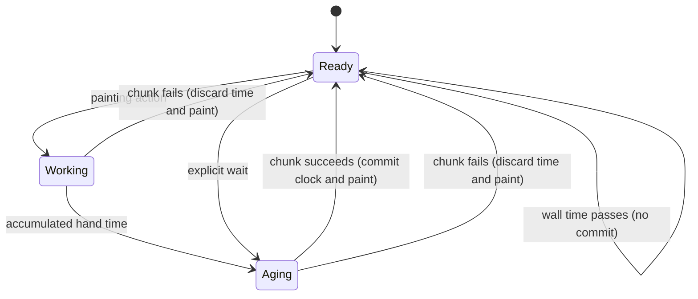

# The painting clock

## Summary

Paint dries on a simulated painting clock. Painting actions and explicit waits advance it; real time spent thinking or waiting for a model does not. `drying(x,y)` reports whether paint at a point is open, setting, tacky or dry.

> Technical note: Receipts: `crates/easel/src/time.rs:1`, `crates/easel/src/api.rs:1435`, `crates/paint/src/tally.rs:1` and `notes/easel_guide.md:411`.

## The simple case

The painter lays wet paint, checks its drying state, then submits a wait in minutes. The wait simulates aging and returns the new painting day and time. Painting over it afterward encounters the aged film. A long pause between requests alone leaves the paint unchanged.

## The interaction, event by event

### Starting

The initialized canvas starts at day 1, 09:00. A wait takes simulated minutes and requires a canvas. A drying query first accounts for hand time already spent in the current chunk, so it does not read an artificially earlier state.

### Ending at once

Negative waits, nonfinite waits and values above the maximum are rejected. A zero wait is valid and can flush owed hand time. A query or wait without a canvas fails under the chunk rule.

### Becoming extended

The simulator advances paint aging rather than sleeping for the requested minutes. Its computation can take real time, but the requested duration and compute duration are different quantities. A long painting passage ages in slices so its earliest strokes can set before the passage ends.

### While extended

Each film ages according to its material, oil and thickness. Open paint blends and lifts; setting paint is less workable; tacky paint is set and can grab the brush; dry means touch-dry rather than a promise of complete chemical curing. Wet paint over set paint can be lifted down to the set film by a rag.

### Finishing

The successful chunk keeps paint aging and clock changes together. Failed chunks restore both. A wait returns a formatted time of day; drying returns a named stage. Looking and writing notes between chunks add no hand time. Finishing uses simulated waits before applying whole-picture effects, as described in [delivery](../delivery/replay.md).

## Modifiers

| Variant | Set at the start | Changed while extended |
|---|---|---|
| Wait duration | From 0 through 5,259,600 minutes per call. | Fixed for that call; later calls in the chunk can add more. |
| Painting action | Stroke length, tool size, touches and palette trips contribute hand time. | Submitted actions determine the work; no external live steering exists. |
| Materials | Pigment, thickness and medium influence aging. | New paint can be laid by later operations, but another client cannot edit a running chunk. |
| Query point | Selects the location for a drying report. | Another location requires another query. |
| Real pause | No effect on painting time. | No effect on painting time. |

## Cancel and interrupt

| Event | Before extended | While extended |
|---|---|---|
| Explicit abort | A queued disconnected request can be skipped. | Stopping the client does not guarantee aging stops; commands owns accepted-request behavior. |
| Another action | Another ordinary request waits. | It cannot inject an action into this wait or passage. |
| Environment failure | Missing session or canvas prevents the operation. | Lua failure restores time with paint; process/storage failures follow commands' distinct rules. |
| Target changed externally | Log integrity can reject the request. | External log changes can block persistence, not selectively rewind the clock. |
| Input channel changed | A wait remains simulated minutes through terminal or harness. | Changing channel does not convert it into real sleep. |

## Interactions with other systems

**Access.** No real-time service is required to age paint. The simulator controls painting time.

**History.** Time-changing operations are retained through their successful chunk source and replayed deterministically.

**Containers.** Each session has its own clock and films. Another painting's waits do not age this one.

**Restricted state.** Wait and drying need a canvas. Whole-picture finishing refuses any film that is not touch-dry.

**Offline.** Clock advancement is local and independent of provider availability.

**Collaboration.** Shared session clients observe the same serialized painting clock.

**Notifications.** Wait returns day and time; drying returns the stage. Compute duration in chunk replies is wall time, not painting time.

**Preferences.** Hand time is always enabled in the current easel. There is no painter option to freeze drying while making marks.

## Edge cases

- Long passes age in 15-minute hand-time slices.
- Individually submitted strokes accumulate hand time, flushed when a minute is owed, before a query/wait and at chunk completion.
- Knifing a pile costs 20 seconds; a normal palette reload costs 2.5 seconds. Reusing a pile no longer in the recent palette ledger can incur mixing time again.
- The recent palette ledger holds 16 entries. It tracks palette-trip cost, not deletion of Lua pile globals.
- The maximum is per wait call, not a lifetime limit on the painting clock.
- Displayed day/time rounds down to whole minutes, so a short action can consume time without changing the displayed minute.
- Rag dampness decays with painting time; [rags](rags.md) owns the cloth's state and thresholds.

## Open questions and verification

The drying model is simulated material behavior, not a prediction of real pigment safety or conservation outcomes. Exhaustive pigment/thickness aging and ten-year waits are not part of the short probe pass. Palette guide wording is recorded in [triage](../bug-triage.md).

Source-reviewed against `../claude-paint` commit `4e525e50897807e9b5f734071dfeb330f1a393d3`; see [verification](../verification/README.md).
