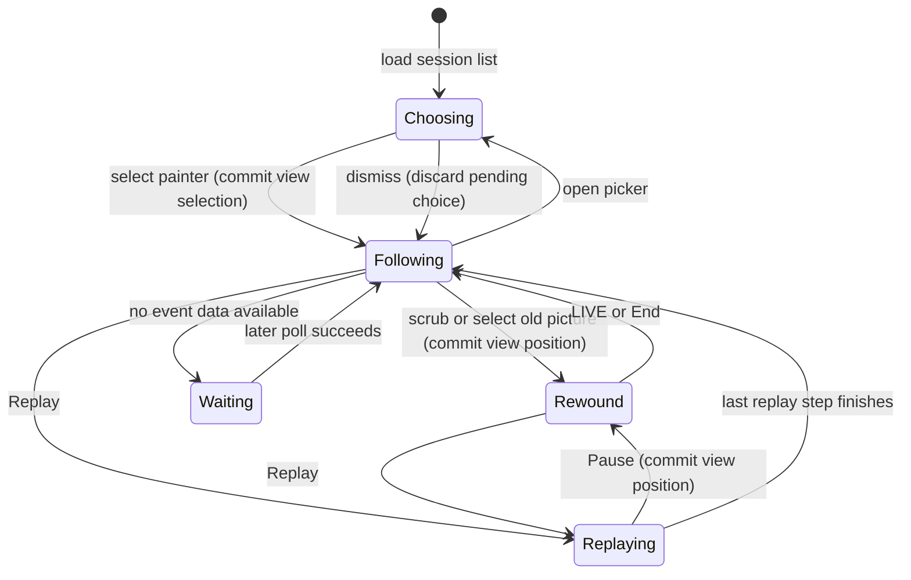

# The studio viewer

## Summary

The studio viewer watches recorded painter activity without changing the painting.
It combines a painting image, the painter's thoughts and actions, optional source code and a strip of recorded pictures.
The header opens a painter picker; the bottom controls move between the latest activity and earlier events.
A painter can span several sittings, separated in the strip and timeline.
The same page runs against a local server, a public server or exported static files.
These surfaces differ in which sessions appear, update frequency and available links.

> Technical note: Receipts: `studio/index.html:186`, `studio/index.html:235`, `studio/studio.py:462` and `studio/studio.py:563`. This is recorded conversation playback, not execution of the [painting log](../delivery/replay.md).

## The simple case

The page selects a painter and displays its latest recorded whole-canvas look.
The adjacent journal shows thoughts as prose and actions as compact chips.
New activity advances the page while it is following the latest event.
Choosing Replay moves through the whole-canvas looks, with the journal and code at those points.
After the last replay picture the page returns to the latest activity.
Selecting another painter changes the watched history and replaces the painter query in the address.
None of these actions adds a chunk, changes paint or advances the [painting clock](../painting/time.md).

> Technical note: Receipts: `studio/index.html:335`, `studio/index.html:614`, `studio/index.html:787` and `studio/index.html:795`; viewer requests in `studio/studio.py:561` read existing records.

## The interaction, event by event

### Starting

An explicit painter address chooses that painter; a local single-session address chooses only that sitting.
Without a target, the page prefers an active painter with a picture and the highest picture index, then a listed painter with a picture, then the first available entry.
The picker places active painters first and the remaining painters newest first.
Its cards show title, model, subject when known, date and an activity indicator.
A title can come from the painter's closing reply; the static site can substitute gallery titles and thumbnails.
A gallery entry can also add a link to the finished painting.

Opening the picker focuses the current choice or first card.
Arrow keys move through cards in reading order; Home and End move to the first and last card.
Enter or Space activates the focused button.
Escape or the close button dismisses the picker and returns focus to the header button.
Clicking outside or moving focus outside dismisses it without moving focus back.
While open, background session refreshes do not rebuild the focused card list.

> Technical note: Receipts: `studio/index.html:267`, `studio/index.html:294`, `studio/index.html:309`, `studio/index.html:322` and `studio/index.html:359`.

### Ending at once

Choosing the current painter only dismisses the picker.
Replay does nothing if there are no eligible pictures.
A painter address whose event data is unavailable stays selected and shows a waiting message; later polls can populate it.
An existing painter with events but no canvas look instead gets “No picture yet.”
A reference picture can appear beside that empty painting area without being labeled as the painter's own work.

> Technical note: Receipts: `studio/index.html:335`, `studio/index.html:398`, `studio/index.html:409`, `studio/index.html:712` and `studio/index.html:797`.

### Becoming extended

Changing painters clears the previous timeline, pictures, palette and zoom overlay, stops replay and starts loading the chosen history.
A newest-look thumbnail can fill the main area before the full event history arrives.
Responses from the previously selected painter are ignored after the selection changes.
While a requested picture loads, the previous successfully loaded picture stays visible.
Image loading retries and falls back through available view, original and thumbnail versions.

> Technical note: Receipts: `studio/index.html:341`, `studio/index.html:349`, `studio/index.html:395` and `studio/index.html:400`.

### While extended

The live server is polled every two seconds and the session list every 30 seconds.
Static event files are checked at most once a minute after a successful load; unchanged file metadata avoids rebuilding the display.
Arriving tool results can update an action already in the timeline.
New events move the visible position only when following the latest activity.
Rewinding therefore does not stop collection of new events.
A rebuilt source history resets the viewer's recorded events; following versus rewound mode is retained, but replay is stopped.

The main image is the latest whole-canvas look at the visible event.
A later crop, transformed look or reference appears in a secondary area while it is relevant to that sitting or turn.
A crop gets an outline on the main painting; reference pictures get a Reference label.
Before a whole look exists, the viewer can use the latest non-reference canvas picture.
The latest palette look has its own area and does not replace the canvas.
A quiet painter's latest view hides the secondary study picture while retaining the painting and palette.

The journal shows at most the visible event and its 250 predecessors.
Thoughts and final replies appear as prose; actions appear as labeled chips, with fuller text in tooltips.
A newly displayed latest thought can animate into place.
This animation is presentation of a recorded thought, not proof that model text is streaming live.
Clicking a clickable look chip rewinds to its picture.

The optional code pane shows successful painting chunks at the selected point.
At the latest event it can fetch the current painting source file.
Older write/edit histories are reconstructed where possible; failed or unfinished writes are excluded.
When reconstruction is unknown it can fall back to the latest fetched source, so that fallback is not guaranteed historical source.
Hiding code avoids rendering and fetching it until shown again.

> Technical note: Receipts: `studio/index.html:400`, `studio/index.html:546`, `studio/index.html:554`, `studio/index.html:572`, `studio/index.html:600`, `studio/index.html:614`, `studio/index.html:675`, `studio/index.html:700`, `studio/index.html:712` and `studio/index.html:824`. Late-result propagation is specified in `studio/test_studio.py:82`.

### Finishing

Replay starts at the next whole look after the visible event, or at the first if already past the last.
It advances at the selected picture rate, then returns to the latest event.
Pause retains the current replay position.
Previous and next look visit every recorded image, including reference and palette images; they are broader than Replay's whole-canvas sequence.
Next look past the last image returns to the latest event.
The scrub bar moves by event, not by elapsed time or picture number.
Its far-right position follows the latest event again.

The latest position shows LIVE while the painter is considered active and FINISHED after it becomes quiet.
FINISHED is an activity inference, not an easel completion command or proof of artistic completion.
The cutoff is two minutes after closing words or 30 minutes without any event.
The return control becomes End instead of LIVE when inactive.
The picker uses its own 30-minute activity window, so it can still say “painting now” while the watched history says FINISHED after closing words.
The real-time clock sums sitting durations, excluding gaps between sittings.
A separate painting-clock display appears only after a successful paint result reports the easel clock.

> Technical note: Receipts: `studio/index.html:272`, `studio/index.html:449`, `studio/index.html:462`, `studio/index.html:510`, `studio/index.html:700` and `studio/index.html:795`.

## Modifiers

| Variant | Set at the start | Changed while extended |
|---|---|---|
| Painter versus one sitting | Painter combines its sittings; a local single-session link limits history. | Choosing a new target clears the old display and stops replay. |
| All sessions | Local picker can include nonpainter sessions. | Checkbox updates the picker and persists locally; it does not change the current target. |
| Replay speed | Slow means one picture per two seconds; other rates are 1, 2 or 4 per second. | The next scheduled interval uses the new rate; an already scheduled delay remains. |
| Thumbnail or look chip | Selects the image's event and enters rewound mode. | Stops replay and changes the displayed point. |
| Arrow keys | Left/right move one event; right reaching the end follows latest activity. | Stops replay, except that reaching the end enters following mode. |
| Bracket keys | `[` and `]` select previous/next image. | Stops replay; next beyond the last image follows latest activity. |
| Space or `l` | Space starts/pauses replay; `l` returns to latest activity. | Repeats those same controls. |
| Code or `c` | Shows or hides the code pane. | Loads current code when shown at the latest event. |
| Picture click | Opens the clicked canvas, study or palette image enlarged using its original. | Does not pause replay; the overlay keeps the clicked image until dismissed. |
| Stream layout | A nonzero `stream` query loads the broadcast stylesheet. | Painter selection preserves the query; changing layout requires navigation. |
| Public server | Only painter targets are served and text is scrubbed. | Live polling remains available; single-session targets are refused. |
| Static export | Reads exported histories and images with slower event refresh. | New exports can appear on subsequent checks; there is no live easel connection. |

> Technical note: Receipts: `studio/index.html:206`, `studio/index.html:241`, `studio/index.html:393`, `studio/index.html:795`, `studio/studio.py:563` and `studio/export_static.py:120`. Global shortcuts skip inputs, selects, textareas, the picker and Meta/Ctrl/Alt combinations; focused buttons retain their own Enter/Space actions (`studio/index.html:816`).

## Cancel and interrupt

| Event | Before extended | While extended |
|---|---|---|
| Explicit abort | Picker dismissal leaves the selected painter unchanged. | Pause stops replay; clicking zoom or Escape dismisses enlargement. Closing the page stops watching, not painting. |
| Another action | A new selection establishes another target. | New painter selection invalidates old polls and closes zoom. Scrubbing, image selection or step controls stop replay; code toggling and zoom do not. |
| Environment failure | Initial session-list failure prevents normal viewer startup; no recovery handler is installed there. | Event failures retain existing data without an explicit disconnected badge. Failed images retry and retain the previous image. |
| Target changed externally | New records become available when the target is loaded. | Polls append events and update late results; a rebuilt history resets the timeline. Static changes wait for the next permitted check. |
| Input channel changed | Pointer buttons and supported shortcuts select the same actions. | Input/select focus suppresses global shortcuts; picker arrows navigate choices instead of timeline events. |

The view position and enlarged picture are browser state only.
No viewer interruption cancels an already running painting chunk.
After an event connection failure, the page can continue displaying a picture whose age is increasing.

> Technical note: Receipts: `studio/index.html:335`, `studio/index.html:395`, `studio/index.html:409`, `studio/index.html:811` and `studio/index.html:824`; read-only server endpoints are in `studio/studio.py:561`.

## Interactions with other systems

**Access.** The default server binds to loopback on port 8765. Public mode filters targets and scrubs the serving account's home path and account name from text responses; it does not provide a login screen. The source-file endpoint serves identified painting source paths rather than arbitrary requested files.

**History.** Viewer replay reads recorded pictures and conversation events. It neither reruns Lua nor creates undo history. Painter changes replace the current address instead of adding a browser-history entry.

**Containers.** A painter folder groups several sittings. Their boundaries are shown in the thumbnail strip, scrub-bar ticks and journal. Local single-session links expose only one history.

**Restricted state.** Missing pictures do not prevent viewing available text. Public mode hides all sessions and refuses single-session requests. Static exports contain painter histories only.

**Offline.** Already loaded history can remain visible after connection loss, but uncached pictures and new events need their server. Static means file-backed hosting, not a promised installed offline application.

**Collaboration.** Each browser has its own selection, replay position and code visibility. Watching does not send painting commands or share the viewer's position with another viewer.

**Notifications.** LIVE, FINISHED, REPLAY and REWOUND describe viewer state. Tool failures receive failure wording in the journal. A failed event fetch before any events is presented as a painter that has not started, not as a network error.

**Preferences.** All sessions and acknowledgment of the static introduction persist in browser storage. Replay speed and code visibility are page state. The static introduction is omitted in stream layout.

> Technical note: Receipts: `studio/studio.py:36`, `studio/studio.py:548`, `studio/studio.py:563`, `studio/studio.py:608`, `studio/studio.py:625`, `studio/index.html:335`, `studio/index.html:393`, `studio/index.html:480`, `studio/index.html:510` and `studio/index.html:827`. Source-file restriction is specified in `studio/test_studio.py:74`.

## Edge cases

- A reference-only history has no painting thumbnail; the reference remains explicitly separate from the painter's work.
- A stopped or interrupted run can say FINISHED even when the painter never issued a finishing command.
- Static listings omit quiet untitled runs unless recent closing words, a gallery entry or the explicit selected address keep them listed. Recent closing words retain a run for six hours; active means within 30 minutes.
- Old static single-session links attempt to resolve to the owning painter. Public live single-session links are refused instead.
- In stream layout the playback controls and finished-painting link are hidden, while the picture strip remains. Keyboard handlers remain installed.
- Stream layout enlarges text and makes a study picture prominent. Tall paintings use side-by-side placement; a palette can occupy another region beside the study.
- Static thumbnails and main views can use reduced JPEG copies; enlargement requests the original image. Missing reduced copies fall back when available.
- Static export includes a gallery page-view counter and copies the stream stylesheet. Export generation owns its output list and removes stale files it previously wrote; it refuses an unrelated output folder.
- Pausing replay stops its timer, not source polling. New activity can accumulate while the visible point stays fixed.

> Technical note: Receipts: `studio/index.html:246`, `studio/index.html:272`, `studio/index.html:385`, `studio/index.html:700`, `studio/index.html:712`, `studio/stream.css:1`, `studio/stream.css:41`, `studio/export_static.py:82` and `studio/export_static.py:185`. Relevant source tests: `studio/test_studio.py:127`, `studio/test_studio.py:156`, `studio/test_studio.py:180`, `studio/test_studio.py:251` and `studio/test_studio.py:278`.

## Open questions and verification

- Nonshrinking in-place history rewrites can leave the running parser with stale events; a fresh parser sees the new text. Append-only history is the exercised normal path; broader rewrite support is a [product call](../bug-triage.md#b22--equal-size-or-growing-history-rewrites-can-stay-stale).

- The [runtime pass](../verification/evidence/runtime-viewer.md#expanded-static-and-public-browser-pass) found stream-header overflow at 390 pixels; ordinary public mode fit. Phone support for broadcast layout remains a product call in [B15](../bug-triage.md#b15--stream-header-overflows-at-phone-width).

- Browser behavior has [agent-driven matrix receipts](../verification/evidence/matrix-viewer.md), including narrow layouts, image fallbacks, live updates and keyboard combinations. Tab-away dismissal and rewound history replacement exposed additional defects in [triage](../bug-triage.md). The human pass remains incomplete.
- Confirmed failure path: if the initial session-list request fails, initialization rejects before polling timers are installed. A transient startup failure can leave the viewer inert until reload. Cause: unhandled `loadSessions()` inside the startup `Promise.all` at `studio/index.html:824`, with the fetch at `studio/index.html:376`.
- Confirmed failure path: initial event network errors and missing painters share the same “hasn't started yet” message. After data exists, failures have no disconnected state. A viewer can mistake stale activity for a healthy connection. Cause: `studio/index.html:409` and activity-only status at `studio/index.html:510`.
- Confirmed defect: Home, End and all four arrow keys in an empty picker raise uncaught browser exceptions; see the [runtime probe](../verification/evidence/runtime-viewer.md#empty-picker-bug-09-reproduced-for-every-navigation-key). Cause: `studio/index.html:365–372`.
- The differing picker and FINISHED activity cutoffs are a product consistency question, not proof that the painter process stopped. Their definitions are at `studio/index.html:272` and `studio/index.html:700`.

Source-reviewed against `../claude-paint` commit `4e525e50897807e9b5f734071dfeb330f1a393d3`; runtime verification is recorded separately in [verification](../verification/README.md).
